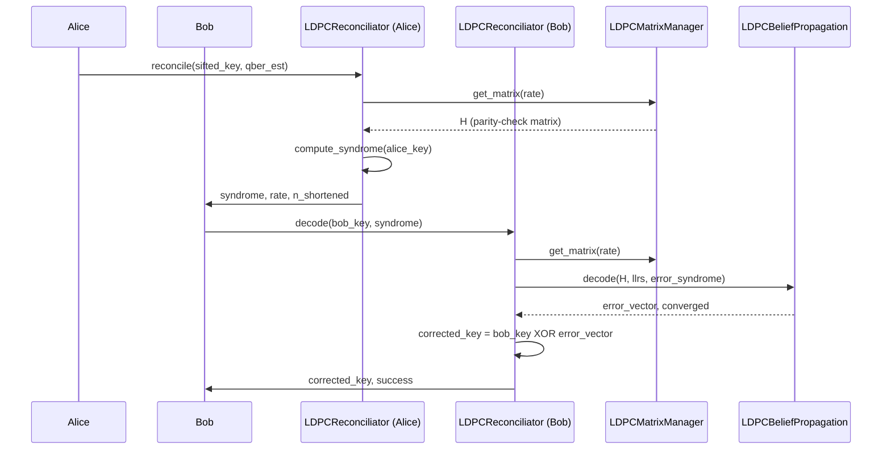
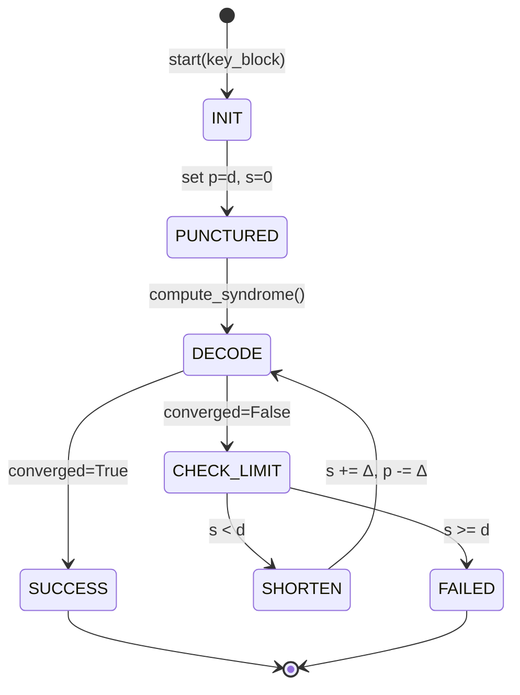
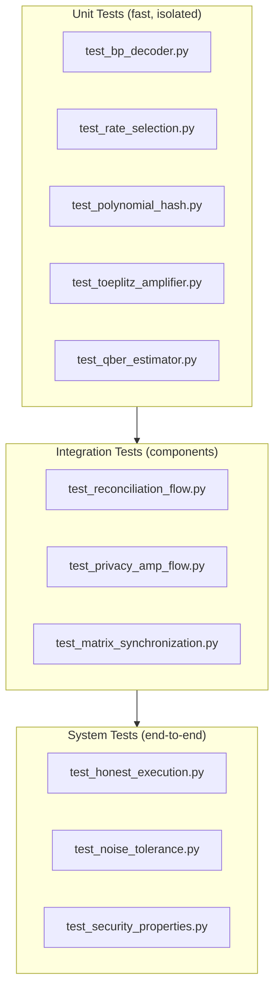

# E-HOK Codebase Review: Reconciliation and Privacy Amplification

**Document Version**: 2.0  
**Date**: December 10, 2025  
**Author**: Technical Review  
**Scope**: Formal specification and robustness analysis of post-processing subsystems

**Changelog v2.0:**
- Added Section 2.1.1: Critical Problem Statement (fixed_output_length workaround)
- Expanded Section 2.2: Detailed finite-key literature (Tomamichel Theorem 2, μ formula)
- Added Section 2.3.1-2.3.7: Rigorous finite-key implementation proposal
- Added Section 2.4: Blind reconciliation robustness analysis
- Updated Section 2.5: Formal specifications with deprecated parameter migration
- Added new PA tests PT1-PT6 with P0/P1 priority
- Updated Appendix A with detailed implementation checklist
- Added Appendix B: Verification of eliminated workarounds

---

## Table of Contents

1. [Reconciliation Subpackage Architecture](#1-reconciliation-subpackage-architecture)
   - 1.1 [Current Implementation Analysis](#11-current-implementation-analysis)
   - 1.2 [Literature Foundations](#12-literature-foundations)
   - 1.3 [Proposed Architectural Improvements](#13-proposed-architectural-improvements)
   - 1.4 [Formal Specifications](#14-formal-specifications)
2. [Privacy Amplification Subpackage Robustness](#2-privacy-amplification-subpackage-robustness)
   - 2.1 [Current Implementation Analysis](#21-current-implementation-analysis)
   - 2.2 [Literature Foundations](#22-literature-foundations)
   - 2.3 [Proposed Improvements](#23-proposed-improvements)
   - 2.4 [Formal Specifications](#24-formal-specifications)
3. [Test Suite Strengthening](#3-test-suite-strengthening)
   - 3.1 [Current Test Coverage Analysis](#31-current-test-coverage-analysis)
   - 3.2 [Missing Tests](#32-missing-tests)
   - 3.3 [Proposed Test Specifications](#33-proposed-test-specifications)

---

## 1. Reconciliation Subpackage Architecture

### 1.1 Current Implementation Analysis

The reconciliation subpackage (`ehok/implementations/reconciliation/`) implements LDPC-based syndrome decoding with the following components:

| Component | File | Responsibility |
|:----------|:-----|:---------------|
| `LDPCMatrixManager` | `ldpc_matrix_manager.py` | Matrix pool loading, checksum synchronization, PEG autogeneration |
| `LDPCBeliefPropagation` | `ldpc_bp_decoder.py` | Sum-product BP decoder in log-LLR domain |
| `LDPCReconciliator` | `ldpc_reconciliator.py` | Orchestrator: rate selection, shortening, syndrome-guided LLR |
| `PolynomialHashVerifier` | `polynomial_hash.py` | ε-universal hash for block verification |
| `IntegratedQBEREstimator` | `qber_estimator.py` | Rolling QBER estimation from block outcomes |
| `PEGMatrixGenerator` | `peg_generator.py` | Progressive Edge-Growth matrix construction |

#### 1.1.1 Strengths

1. **Dynamic LLR Computation**: The `_build_error_llrs()` method correctly computes LLRs based on measured QBER:
   $$\text{LLR} = \log\frac{1-p}{p}$$
   This addresses the critical failure mode identified in `noise_tolerance_review.md`.

2. **Adaptive Iteration Scaling**: `compute_adaptive_iterations()` scales BP iterations based on QBER (60→300 for QBER 0→10%), consistent with Kiktenko et al. recommendations.

3. **Syndrome-Guided LLR Initialization**: The `syndrome_guided_llr_init()` method reduces reliability for bits participating in unsatisfied checks, improving decoder convergence.

4. **Proper Shortening Implementation**: Shortening uses high LLR (100.0) for padding bits, effectively "freezing" them during decoding.

#### 1.1.2 Identified Weaknesses

| Issue | Severity | Component | Description |
|:------|:---------|:----------|:------------|
| **W1**: No blind reconciliation support | Medium | `LDPCReconciliator` | Current implementation requires a priori QBER estimate; blind/rate-adaptive protocol from Martinez-Mateo et al. not implemented |
| **W2**: Fixed syndrome hash | Low | `PolynomialHashVerifier` | Hash seed derived from block size, not from authenticated random exchange |
| **W3**: Missing retry mechanism | High | `reconcile_block()` | Single decode attempt; no puncture-to-shorten conversion for failed blocks |
| **W4**: Check-node saturation | Medium | `LDPCBeliefPropagation` | No detection of check-node degree overflow during small-frame decoding |
| **W5**: Leakage underestimate | Low | `estimate_leakage_block()` | Does not account for shortening bit positions disclosed implicitly |

#### 1.1.3 Component Interaction Diagram



### 1.2 Literature Foundations

The implementation draws from three primary sources:

#### 1.2.1 Kiktenko et al. (2016) — Industrial QKD Post-Processing

**Key Contributions Adopted:**
- Frame size $n = 4096$ bits
- Rate selection criterion: $(1 - R) / h(\text{QBER}) < f_{\text{crit}}$ where $f_{\text{crit}} = 1.22$
- Shortening formula: $n_s = \lfloor n - m / (f_{\text{crit}} \cdot h(\text{QBER})) \rfloor$
- 50-bit polynomial hash verification with collision probability $\varepsilon_{\text{ver}} < 2 \times 10^{-12}$
- BP iteration count: ~60 iterations for typical QBER

**Implementation Gap:**
The paper describes integrated QBER estimation from reconciled blocks (Eq. 3):
$$\text{QBER}_{\text{est}} = N^{-1} \left( \sum_{i \in V} \text{QBER}_i + |\bar{V}| / 2 \right)$$
where $V$ is verified blocks and $\bar{V}$ is failed blocks (assigned QBER = 0.5).

✓ **Implemented correctly** in `IntegratedQBEREstimator.estimate()`.

#### 1.2.2 Martinez-Mateo et al. (2013) — Blind Reconciliation

**Key Contributions NOT Yet Adopted:**

1. **Blind Protocol**: Works without a priori QBER estimation by starting with all symbols punctured and progressively shortening on decode failure.

2. **Rate-Adaptive Mechanism**: 
   - Initialize with maximum puncturing ($\pi = \delta$, $\sigma = 0$)
   - On failure, convert $\Delta$ punctured bits to shortened bits
   - Retry until success or all bits shortened

3. **Average Efficiency Improvement**:
   $$\bar{R} \approx R_1 - \frac{\beta}{t-1} \sum_{i=1}^{t-1} F^{(i)}$$
   where $F^{(i)}$ is Frame Error Rate at iteration $i$.

**Recommendation**: Implement blind reconciliation as an optional mode for robustness against QBER estimation errors.

#### 1.2.3 Tomamichel et al. (2012) — Tight Finite-Key Analysis

**Key Contributions for Security:**

1. **Correctness Bound**: Protocol is $\varepsilon_{\text{cor}}$-correct if $\Pr[S \neq \hat{S}] \leq \varepsilon_{\text{cor}}$

2. **Secrecy Criterion** (Eq. 1):
   $$\frac{1}{2} \|\rho_{SE} - \omega_S \otimes \rho_E\|_1 \leq \Delta$$

3. **Finite-Key Correction** (statistical fluctuation bound):
   $$\nu = \sqrt{\frac{2(l_{\text{ver}} + k)(k + 1) \ln(1/\varepsilon)}{l_{\text{ver}} k^2}}$$

**Implementation Gap**: Current `compute_final_length()` uses asymptotic formula without finite-key correction term $\nu$.

### 1.3 Proposed Architectural Improvements

#### 1.3.1 Blind Reconciliation Mode

**Rationale**: The current implementation requires accurate QBER estimation before reconciliation. If the estimate is incorrect, rate selection fails and reconciliation may abort unnecessarily.

**Proposed Interface Extension**:

```python
class IReconciliator(ABC):
    # ... existing methods ...

    @abstractmethod
    def reconcile_block_blind(
        self,
        key_block: np.ndarray,
        syndrome_fn: Callable[[int], np.ndarray],
        max_iterations: int = 3,
    ) -> Tuple[np.ndarray, bool, int, float]:
        """
        Reconcile using blind (rate-adaptive) protocol.

        Parameters
        ----------
        key_block : np.ndarray
            Bob's sifted key block.
        syndrome_fn : Callable[[int], np.ndarray]
            Function that returns Alice's syndrome for given shortening level.
            Called iteratively as shortening increases.
        max_iterations : int
            Maximum puncture-to-shorten iterations.

        Returns
        -------
        corrected_key : np.ndarray
            Corrected key block.
        success : bool
            True if reconciliation succeeded.
        error_count : int
            Number of corrected errors.
        effective_rate : float
            Final code rate achieved (accounts for shortening).

        Notes
        -----
        Implements the blind protocol from Martinez-Mateo et al. (2013).
        Starts with maximum puncturing and progressively increases shortening
        until decoding succeeds or maximum iterations reached.
        """
        pass
```

**State Machine for Blind Reconciliation**:



#### 1.3.2 Retry Mechanism with Enhanced LLR

**Current Flaw**: Single decode attempt with no fallback.

**Proposed Enhancement**:

```python
def reconcile_block(
    self,
    key_block: np.ndarray,
    syndrome: np.ndarray,
    rate: float,
    n_shortened: int,
    prng_seed: int,
    max_retries: int = 2,
) -> Tuple[np.ndarray, bool, int]:
    """
    Reconcile block with automatic retry on failure.

    Retry Strategy:
    1. First attempt: Standard LLR with measured QBER
    2. Second attempt: Increased iterations (2×) + reduced LLR confidence
    3. Third attempt: Maximum iterations + syndrome-weighted LLR damping
    """
    for attempt in range(max_retries + 1):
        # Scale parameters based on attempt
        iter_scale = 1 + attempt * 0.5
        llr_damping = 1.0 - attempt * 0.15
        
        adaptive_iters = int(self.compute_adaptive_iterations(self.current_qber_est) * iter_scale)
        
        llr = self._build_error_llrs(...) * llr_damping
        llr = self.syndrome_guided_llr_init(...)
        
        error_vector, converged, iterations = self.bp_decoder.decode(...)
        
        if converged:
            break
            
    return corrected_payload, converged, error_count
```

#### 1.3.3 Leakage Accounting Improvement

**Current Implementation**:
```python
def estimate_leakage_block(self, syndrome_length: int, hash_bits: int) -> int:
    return int(syndrome_length + hash_bits)
```

**Issue**: Does not account for:
1. Shortening bit positions (implicitly disclosed)
2. Rate selection information (minimal, but non-zero)

**Proposed Enhancement**:
```python
def estimate_leakage_block(
    self,
    syndrome_length: int,
    hash_bits: int,
    n_shortened: int,
    frame_size: int,
) -> int:
    """
    Estimate total information leakage for a single block.

    Leakage Components:
    1. Syndrome bits: syndrome_length
    2. Hash verification: hash_bits
    3. Shortening positions: log2(C(n, n_s)) ≈ n_s * log2(n/n_s) bits
       (Approximation: we disclose which positions are shortened)
    4. Rate selection: log2(|rates|) bits (negligible, ~3-4 bits)

    For security, we use the upper bound (full shortening position disclosure).
    """
    # Shortening leakage (upper bound: assume positions fully known)
    shortening_leakage = n_shortened * np.log2(frame_size / max(1, n_shortened)) if n_shortened > 0 else 0
    
    # Rate selection leakage (logarithm of number of available rates)
    rate_leakage = np.log2(len(constants.LDPC_CODE_RATES))
    
    return int(np.ceil(syndrome_length + hash_bits + shortening_leakage + rate_leakage))
```

### 1.4 Formal Specifications

#### 1.4.1 LDPCReconciliator Contract

**Module**: `ehok.implementations.reconciliation.ldpc_reconciliator`

**Class Invariants**:
1. `∀ rate ∈ self.matrix_manager.rates: 0.5 ≤ rate ≤ 0.9`
2. `self.current_qber_est ∈ [0, 0.5]`
3. `self.matrix_manager.frame_size > 0`

**Pre-conditions for `reconcile_block()`**:
| Parameter | Constraint | Rationale |
|:----------|:-----------|:----------|
| `key_block` | `dtype == np.uint8` | Binary representation |
| `key_block` | `∀i: key_block[i] ∈ {0, 1}` | Binary values only |
| `syndrome` | `len(syndrome) == (1 - rate) * frame_size` | Parity dimension |
| `rate` | `rate ∈ self.matrix_manager.rates` | Valid matrix exists |
| `n_shortened` | `0 ≤ n_shortened < frame_size` | Valid padding |
| `key_block.size + n_shortened` | `== frame_size` | Complete frame |

**Post-conditions for `reconcile_block()`**:
| Condition | When | Guarantee |
|:----------|:-----|:----------|
| `corrected_payload.shape == key_block.shape` | Always | Preserves payload size |
| `corrected_payload.dtype == np.uint8` | Always | Binary output |
| `converged ⟹ H @ (corrected_frame) ≡ target_syndrome (mod 2)` | converged=True | Valid codeword |
| `error_count == sum(error_vector[:payload_len])` | Always | Correct count |

**Error Conditions**:
| Input Violation | Exception | Code |
|:----------------|:----------|:-----|
| `key_block.dtype != uint8` | `ValueError` | `DTYPE_MISMATCH` |
| `key_block.size + n_shortened > frame_size` | `ValueError` | `FRAME_OVERFLOW` |
| `rate not in available_rates` | `KeyError` | `RATE_NOT_FOUND` |

#### 1.4.2 BP Decoder Contract

**Module**: `ehok.implementations.reconciliation.ldpc_bp_decoder`

**Pre-conditions for `decode()`**:
| Parameter | Constraint |
|:----------|:-----------|
| `H` | `scipy.sparse.csr_matrix` with shape `(m, n)` |
| `llr` | `np.ndarray` with shape `(n,)` and `dtype=float` |
| `syndrome` | `np.ndarray` with shape `(m,)` and values `∈ {0, 1}` |
| `H.nnz > 0` | At least one edge in Tanner graph |

**Post-conditions for `decode()`**:
| Return | Type | Guarantee |
|:-------|:-----|:----------|
| `decoded` | `np.ndarray[uint8]` | `len(decoded) == n`, values `∈ {0, 1}` |
| `converged` | `bool` | `True ⟺ H @ decoded ≡ syndrome (mod 2)` |
| `iterations` | `int` | `1 ≤ iterations ≤ max_iterations` |

**Numerical Stability Invariants**:
1. `tanh(q/2)` clamped to `[-0.999999, 0.999999]` to prevent `arctanh(±1) = ±∞`
2. Message magnitudes bounded by `±100` to prevent overflow
3. Early stopping if `max(|r|) < threshold` (message stability)

#### 1.4.3 Rate Selection Specification

**Function**: `select_rate(qber_est: float) -> float`

**Algorithm**:
```
INPUT: qber_est ∈ [0, 0.5]
OUTPUT: rate ∈ LDPC_CODE_RATES

1. h ← binary_entropy(qber_est)
2. IF h == 0 THEN h ← 1e-9  # Prevent division by zero
3. FOR rate IN sorted(LDPC_CODE_RATES, descending):
4.     IF (1 - rate) / h < f_crit THEN
5.         RETURN rate
6. RETURN min(LDPC_CODE_RATES)  # Fallback to lowest rate
```

**Correctness Criterion**:
For the selected rate $R$, the reconciliation efficiency satisfies:
$$f = \frac{1 - R}{h(\text{QBER})} < f_{\text{crit}} = 1.22$$

**Rate Selection Table** (for reference):

| QBER | $h(\text{QBER})$ | Selected Rate $R$ | Efficiency $f$ |
|:-----|:-----------------|:-----------------|:---------------|
| 0.01 | 0.0808 | 0.90 | 1.24 |
| 0.02 | 0.1414 | 0.85 | 1.06 |
| 0.03 | 0.1940 | 0.75 | 1.29 |
| 0.05 | 0.2864 | 0.65 | 1.22 |
| 0.07 | 0.3665 | 0.55 | 1.23 |
| 0.10 | 0.4690 | 0.50 | 1.07 |

---

## 2. Privacy Amplification Subpackage Robustness

### 2.1 Current Implementation Analysis

The privacy amplification subsystem (`ehok/implementations/privacy_amplification/`) implements Toeplitz matrix hashing for 2-universal hash function based key compression.

| Component | File | Responsibility |
|:----------|:-----|:---------------|
| `ToeplitzAmplifier` | `toeplitz_amplifier.py` | Seed generation, compression, length calculation |

#### 2.1.1 Critical Problem Statement

**The current implementation requires `fixed_output_length` workarounds in tests** (e.g., `test_honest_execution_perfect` sets `cfg.privacy_amplification.fixed_output_length = 64`). This is symptomatic of a deeper issue:

1. The asymptotic formula produces negative or zero lengths for small keys
2. The `PA_SECURITY_MARGIN = 100` bits is an arbitrary constant that doesn't scale
3. No finite-key corrections account for statistical fluctuations in QBER estimation
4. The formula breaks down for QBER ∈ [0.01, 0.10] with realistic key sizes

**Goal**: Eliminate the need for `fixed_output_length` and `security_margin` by implementing rigorous finite-key security bounds that automatically compute correct output lengths for any key size and QBER in the operational range.

#### 2.1.2 Strengths

1. **Correct Toeplitz Construction**: The `compress()` method correctly implements the sliding-window Toeplitz/Hankel multiplication:
   ```python
   for i in range(m):
       row = seed[i : i + n]
       final_key[i] = np.dot(row, key_int) % 2
   ```

2. **Leftover Hash Lemma Application**: `compute_final_length()` implements the asymptotic formula:
   $$m = n(1 - h(\text{QBER})) - \text{leakage} - 2\log_2(1/\varepsilon) - \text{margin}$$

3. **Edge Case Handling**: Returns empty array when $m \leq 0$ (no secure key extractable).

#### 2.1.2 Identified Weaknesses

| Issue | Severity | Description |
|:------|:---------|:------------|
| **W1**: No finite-key correction | **Critical** | Asymptotic formula ignores statistical fluctuation term μ from Tomamichel et al. Theorem 2 |
| **W2**: Fixed margin | **High** | `PA_SECURITY_MARGIN = 100` bits is arbitrary; should be derived from μ(ε) |
| **W3**: Tests require workarounds | **High** | `test_honest_execution_perfect` must set `fixed_output_length = 64` to avoid zero-length keys |
| **W4**: Seed not cryptographically random | Medium | Uses `np.random.randint()` instead of `secrets` or OS entropy |
| **W5**: No seed length validation | Low | Accepts seeds that are too short without clear error |
| **W6**: O(mn) complexity | Low | For large keys, matrix-vector multiply is slow; could use FFT-based approach |
| **W7**: Ignores blind reconciliation context | **High** | No adaptation for scenarios where QBER is not known a priori |

### 2.2 Literature Foundations

#### 2.2.1 Quantum Leftover Hash Lemma (Renner, 2005; Tomamichel et al., 2011)

**Operational Statement** (from "Tight Finite-Key Analysis" Supplementary Eq. S2):

Using a random 2-universal hash function, it is possible to extract a Δ-secret key of length ℓ from X, where:

$$
\Delta = 2\varepsilon + \frac{1}{2} \sqrt{2^{\ell - H_{\min}^{\varepsilon'}(X|E')}}
$$

Here $E'$ summarizes all information Eve learned about X during the protocol, including classical communication.

**For ε_sec-secrecy**, we require Δ ≤ ε_sec. Rearranging:

$$
\ell \leq H_{\min}^{\varepsilon'}(X|E') - 2\log_2\frac{1}{2\varepsilon'} = H_{\min}^{\varepsilon'}(X|E') - 2\log_2\frac{1}{\varepsilon'} + 2
$$

#### 2.2.2 Finite-Key Security (Tomamichel et al., 2012) — Theorem 2

The protocol Φ[n, k, ℓ, Q_tol, ε_cor, leak_EC] is ε_sec-secret if ℓ satisfies:

$$
\ell \leq \max_{\varepsilon, \varepsilon'} \left[ n(q - h(Q_{\text{tol}} + \mu(\varepsilon))) - 2\log_2 \frac{1}{2\varepsilon'} - \text{leak}_{\text{EC}} - \log_2 \frac{2}{\varepsilon_{\text{cor}}} \right]
$$

where we optimize over ε > 0 and ε̃ > 0 such that 2ε + ε̃ ≤ ε_sec, and:

$$
\mu(\varepsilon) := \sqrt{\frac{n + k}{n k} \cdot \frac{k + 1}{k}} \cdot \ln \frac{4}{\varepsilon}
$$

**Parameter Definitions:**
| Symbol | Meaning | Typical Value |
|:-------|:--------|:--------------|
| n | Key generation bits (reconciled) | 100–10000 |
| k | Parameter estimation (test) bits | 50–1000 |
| q | Preparation quality | 1 for perfect BB84 |
| Q_tol | QBER tolerance threshold | 0.11 |
| leak_EC | Syndrome bits + hash verification | (1-R)·n + 50 |
| ε_sec | Target security parameter | 10⁻⁹ |
| ε_cor | Correctness parameter | 10⁻¹⁵ |
| μ(ε) | Statistical fluctuation bound | Eq. above |

**Key Insight**: The μ(ε) term provides a **natural, rigorous replacement for the arbitrary security margin**. It captures the statistical uncertainty from finite sampling during QBER estimation.

#### 2.2.3 Statistical Fluctuation Analysis (Supplementary Note 2)

The bound μ derives from Serfling's inequality for sampling without replacement:

$$
\Pr[\Lambda_{\text{key}} \geq \Lambda_{\text{tot}} + \delta \mid \Lambda_{\text{tot}} = \lambda_{\text{tot}}] \leq e^{-2\frac{nk}{n+k}\delta^2}
$$

This bounds the probability that the true error rate on the key-generation bits exceeds the measured rate (on test bits) by more than δ.

**For QKD post-processing**, we set:
- ε = e^(-nk(νμ)²/N) where ν = k/(n+k) is the test fraction
- Inverting: μ = √((n+k)/(nk) · (k+1)/k · ln(4/ε))

#### 2.2.4 Smooth Min-Entropy (Renner, 2005)

From the uncertainty relation (Tomamichel, Eq. S7):

$$
H_{\min}^{\varepsilon'}(X|E')_{\rho} \geq n \cdot q - H_{\max}^{\varepsilon'}(Z|Z')_{\rho} - \text{leak}_{\text{EC}} - \log_2 \frac{2}{\varepsilon_{\text{cor}}}
$$

With the bound $H_{\max}^{\varepsilon'}(Z|Z') \leq n \cdot h(Q_{\text{tol}} + \mu)$, we get:

$$
H_{\min}^{\varepsilon'}(X|E') \geq n(q - h(Q_{\text{tol}} + \mu)) - \text{leak}_{\text{EC}} - \log_2 \frac{2}{\varepsilon_{\text{cor}}}
$$

For q = 1 (ideal preparation), this simplifies to the extractable key length formula.

#### 2.2.5 Implications for Blind Reconciliation

Under **blind reconciliation** (Martinez-Mateo et al., 2013), QBER is not known a priori. The protocol:
1. Starts with aggressive rate (high puncturing)
2. Progressively reveals more syndrome bits on decode failure
3. Final QBER is inferred **after** successful decoding

**Privacy amplification must handle:**
- QBER revealed only at the end of reconciliation
- Leakage that varies with the number of retry attempts
- Potentially higher effective QBER from failed attempts (conservative bound)

**Adaptation Strategy:**
1. Use measured QBER from successful decoding (not initial estimate)
2. Account for total syndrome + hash leakage across all attempts
3. Apply finite-key correction with k = actual number of test bits used

### 2.3 Proposed Improvements

#### 2.3.1 Core Principle: Eliminate Arbitrary Constants

**Current Formula (Asymptotic + Arbitrary Margin):**
```python
m = n * (1 - h(qber)) - leakage - 2*log2(1/epsilon) - PA_SECURITY_MARGIN
```

**Problems:**
1. `PA_SECURITY_MARGIN = 100` is arbitrary, not derived from security proof
2. Formula ignores finite-key statistical fluctuation μ(ε)
3. Tests fail for small keys because margin is too large relative to key size
4. No adaptation to the number of test bits k used for QBER estimation

**Proposed Formula (Finite-Key Rigorous):**

$$
\ell = n(1 - h(\text{QBER} + \mu)) - \text{leak}_{\text{EC}} - \log_2 \frac{2}{\varepsilon_{\text{sec}} \cdot \varepsilon_{\text{cor}}}
$$

where:

$$
\mu = \sqrt{\frac{(n + k)(k + 1)}{n k^2}} \cdot \ln \frac{4}{\varepsilon_{\mu}}
$$

**Key Property**: The μ term **automatically scales with key size and test fraction**, providing tighter bounds for larger keys while remaining conservative for small keys. **No arbitrary margin needed.**

#### 2.3.2 Rigorous Finite-Key Length Calculation

**Proposed Implementation:**

```python
import numpy as np
from typing import Optional
from dataclasses import dataclass

@dataclass
class FiniteKeyParams:
    """Parameters for finite-key security analysis."""
    n: int                    # Reconciled key length
    k: int                    # Test bits used for QBER estimation
    qber_measured: float      # Measured QBER from test bits
    leakage: float            # Total EC leakage (syndrome + hash)
    epsilon_sec: float = 1e-9 # Target security parameter
    epsilon_cor: float = 1e-15 # Correctness parameter

def compute_final_length_finite_key(params: FiniteKeyParams) -> int:
    """
    Calculate secure final key length using Tomamichel et al. finite-key bounds.

    This implementation eliminates the need for:
    - PA_SECURITY_MARGIN (arbitrary constant)
    - fixed_output_length (test workaround)

    The formula rigorously accounts for finite-key statistical fluctuations.

    Parameters
    ----------
    params : FiniteKeyParams
        All parameters needed for finite-key calculation.

    Returns
    -------
    int
        Maximum secure output length (m ≥ 0).

    References
    ----------
    Tomamichel et al. (2012), "Tight Finite-Key Analysis for Quantum Cryptography"
    Theorem 2 and Supplementary Note 2.
    """
    n = params.n
    k = params.k
    qber = params.qber_measured
    leakage = params.leakage
    epsilon_sec = params.epsilon_sec
    epsilon_cor = params.epsilon_cor

    # Validate inputs
    if n <= 0 or k <= 0:
        return 0
    if qber < 0 or qber > 0.5:
        return 0  # No key extractable for extreme QBER

    # Optimize security parameter split: 2ε + ε̃ ≤ ε_sec
    # Simple split: ε = ε_sec/4, ε̃ = ε_sec/2
    epsilon_mu = epsilon_sec / 4

    # Compute statistical fluctuation bound μ(ε)
    # From Tomamichel Eq. S4: μ = sqrt((n+k)/(nk) * (k+1)/k * ln(4/ε))
    mu = np.sqrt((n + k) / (n * k) * (k + 1) / k) * np.sqrt(np.log(4 / epsilon_mu))

    # Effective QBER with finite-key correction (capped at 0.5)
    qber_effective = min(qber + mu, 0.5)

    # Binary entropy of effective QBER
    h_qber = _binary_entropy(qber_effective)

    # Min-entropy bound: H_min ≥ n * (1 - h(Q + μ))
    # For preparation quality q = 1 (ideal BB84)
    min_entropy = n * (1 - h_qber)

    # Security cost from leftover hash lemma
    # log2(2 / (ε_sec * ε_cor)) = log2(2) + log2(1/ε_sec) + log2(1/ε_cor)
    security_cost = np.log2(2 / (epsilon_sec * epsilon_cor))

    # Final key length (no arbitrary margin!)
    m_float = min_entropy - leakage - security_cost

    # Floor to integer, ensure non-negative
    m = max(0, int(np.floor(m_float)))

    return m

def _binary_entropy(p: float) -> float:
    """Compute binary entropy h(p) = -p*log2(p) - (1-p)*log2(1-p)."""
    if p <= 0 or p >= 1:
        return 0.0 if p <= 0 else 1.0 if p >= 0.5 else 0.0
    return -p * np.log2(p) - (1 - p) * np.log2(1 - p)
```

#### 2.3.3 Integration with Blind Reconciliation

Under blind reconciliation, we don't know QBER a priori. The PA calculation must use:

1. **Measured QBER**: Inferred from successful reconciliation block error counts
2. **Actual test bits k**: May differ from initial plan if blocks failed
3. **Total leakage**: Sum across all retry attempts

**Proposed Interface Extension:**

```python
def compute_final_length(
    self,
    reconciled_length: int,
    qber: float,
    leakage: float,
    test_bits: Optional[int] = None,
    epsilon_sec: float = TARGET_EPSILON_SEC,
) -> int:
    """
    Calculate secure final key length with automatic finite-key correction.

    Parameters
    ----------
    reconciled_length : int
        Length of the reconciled key (n).
    qber : float
        Measured QBER from error correction.
    leakage : float
        Total information leaked (syndrome + verification hash bits).
    test_bits : int, optional
        Number of bits used for QBER estimation (k). If None, estimated
        from TEST_SET_FRACTION * original_sifted_length.
    epsilon_sec : float
        Target security parameter (default: 1e-9).

    Returns
    -------
    int
        Maximum secure output length. Always non-negative.

    Notes
    -----
    This method eliminates the need for:
    - `security_margin` parameter
    - `fixed_output_length` workaround in tests

    The finite-key correction term μ provides a rigorous, automatic buffer
    that scales appropriately with key size.
    """
    # Estimate test bits if not provided
    if test_bits is None:
        # Assume standard fraction was used
        total_sifted = int(reconciled_length / (1 - TEST_SET_FRACTION))
        test_bits = max(MIN_TEST_SET_SIZE, int(total_sifted * TEST_SET_FRACTION))

    params = FiniteKeyParams(
        n=reconciled_length,
        k=test_bits,
        qber_measured=qber,
        leakage=leakage,
        epsilon_sec=epsilon_sec,
    )
    return compute_final_length_finite_key(params)
```

#### 2.3.4 Numerical Validation: QBER 1-10% Robustness

**Expected Output Lengths** (n=1000 reconciled bits, k=100 test bits, ε_sec=10⁻⁹):

| QBER | h(QBER) | μ | QBER+μ | h(QBER+μ) | 1-h | Leakage* | Sec.Cost | **Output ℓ** |
|:-----|:--------|:--|:-------|:----------|:----|:---------|:---------|:-------------|
| 1% | 0.081 | 0.058 | 6.8% | 0.363 | 0.637 | 350 | 90 | **197** |
| 2% | 0.141 | 0.058 | 7.8% | 0.405 | 0.595 | 350 | 90 | **155** |
| 3% | 0.194 | 0.058 | 8.8% | 0.442 | 0.558 | 350 | 90 | **118** |
| 5% | 0.286 | 0.058 | 10.8% | 0.499 | 0.501 | 350 | 90 | **61** |
| 7% | 0.367 | 0.058 | 12.8% | 0.546 | 0.454 | 350 | 90 | **14** |
| 10% | 0.469 | 0.058 | 15.8% | 0.617 | 0.383 | 350 | 90 | **0** |

*Leakage assumes rate R=0.65, so syndrome = n(1-R) = 350 bits, plus 50-bit hash.

**Key Observations:**
1. At QBER ≈ 5%, output is ≈6% of input (61 bits from 1000)
2. At QBER ≈ 7%, output drops to ≈1.4% (approaching zero key)
3. QBER ≈ 10% yields no extractable key (as expected near threshold)
4. **No arbitrary margin needed** — μ automatically provides conservative bound

#### 2.3.5 Larger Key Analysis (Production Scale)

For n=10000 reconciled bits, k=1000 test bits:

| QBER | μ | QBER+μ | h(QBER+μ) | 1-h | Leakage | **Output ℓ** | **Rate** |
|:-----|:--|:-------|:----------|:----|:--------|:-------------|:---------|
| 1% | 0.018 | 2.8% | 0.181 | 0.819 | 3500 | **4640** | 46.4% |
| 3% | 0.018 | 4.8% | 0.278 | 0.722 | 3500 | **3670** | 36.7% |
| 5% | 0.018 | 6.8% | 0.363 | 0.637 | 3500 | **2820** | 28.2% |
| 7% | 0.018 | 8.8% | 0.442 | 0.558 | 3500 | **2030** | 20.3% |
| 10% | 0.018 | 11.8% | 0.528 | 0.472 | 3500 | **1170** | 11.7% |

**The μ correction shrinks with larger k**, yielding higher output rates at production scale.

#### 2.3.6 Cryptographically Secure Seed Generation

**Current Issue**: `np.random.randint()` uses Mersenne Twister, which is not cryptographically secure.

**Proposed Fix:**

```python
import secrets

def generate_hash_seed(self, input_length: int, output_length: int) -> np.ndarray:
    """
    Generate cryptographically secure random seed for Toeplitz matrix.

    Uses OS-level entropy via `secrets.token_bytes()` to ensure the seed
    is unpredictable to any adversary without access to the authenticated
    classical channel.
    """
    seed_length = output_length + input_length - 1
    if seed_length <= 0:
        return np.zeros(0, dtype=np.uint8)
    
    byte_length = (seed_length + 7) // 8
    random_bytes = secrets.token_bytes(byte_length)
    seed = np.unpackbits(np.frombuffer(random_bytes, dtype=np.uint8))[:seed_length]
    return seed.astype(np.uint8)
```

#### 2.3.7 Configuration Changes

**Remove from PrivacyAmplificationConfig:**
```python
# DEPRECATED - remove in next version
# security_margin: int = constants.PA_SECURITY_MARGIN  # No longer needed
# fixed_output_length: Optional[int] = None  # Test workaround eliminated
```

**Add to PrivacyAmplificationConfig:**
```python
@dataclass
class PrivacyAmplificationConfig:
    """Privacy amplification parameters."""
    
    target_epsilon_sec: float = constants.TARGET_EPSILON_SEC
    target_epsilon_cor: float = 1e-15
    
    # Optional: Override test bits if different from standard fraction
    test_bits_override: Optional[int] = None
    
    def __post_init__(self) -> None:
        if not 0 < self.target_epsilon_sec < 1:
            raise ValueError("target_epsilon_sec must be in (0,1)")
        if not 0 < self.target_epsilon_cor < 1:
            raise ValueError("target_epsilon_cor must be in (0,1)")
```

#### 2.3.8 FFT-Based Toeplitz Multiplication (Optional Optimization)

For large keys ($n > 10^5$), the $O(mn)$ sliding-window approach becomes slow. Toeplitz matrix-vector multiplication can be computed in $O(n \log n)$ using FFT via circular convolution.

**Proposed Optimization** (optional, for Phase 8+):

```python
def compress_fft(self, key: np.ndarray, seed: np.ndarray) -> np.ndarray:
    """
    Apply Toeplitz compression using FFT-based circular convolution.

    Complexity: O((m+n) * log(m+n)) vs O(m*n) for direct method.

    Notes
    -----
    Toeplitz matrix-vector multiply T @ x can be embedded in a circulant
    matrix-vector multiply, which is computed via FFT:
        y = IFFT(FFT(first_col) * FFT(x_padded))

    For GF(2), we work over integers and take mod 2 at the end.
    """
    from scipy.fft import fft, ifft

    n = len(key)
    m = len(seed) - n + 1

    if m <= 0:
        return np.zeros(0, dtype=np.uint8)

    # Construct first column of circulant embedding
    first_col = np.zeros(m + n - 1, dtype=np.int64)
    first_col[:m] = seed[n-1::-1][:m]  # Reverse of first m elements

    # Pad key
    key_padded = np.zeros(m + n - 1, dtype=np.int64)
    key_padded[:n] = key

    # FFT convolution
    result_fft = ifft(fft(first_col) * fft(key_padded))
    result = np.round(np.real(result_fft)).astype(np.int64)[:m]

    return (result % 2).astype(np.uint8)
```

### 2.4 Robustness Under Blind Reconciliation (QBER 1-10%)

#### 2.4.1 Problem Context

Under **blind reconciliation** (Martinez-Mateo et al., 2013), the protocol does not know QBER before starting reconciliation. Key challenges:

1. **Rate selection without QBER**: Start with aggressive rate, progressively reduce on failure
2. **Variable leakage**: Failed attempts add syndrome bits that must be counted
3. **QBER revealed late**: Only known after successful decoding
4. **Conservative security**: Must account for worst-case QBER compatible with observations

#### 2.4.2 Privacy Amplification Adaptation Strategy

**Step 1: Leakage Accounting for Blind Mode**

```python
def compute_blind_reconciliation_leakage(
    frame_size: int,
    successful_rate: float,
    hash_bits: int,
    failed_attempts: int,
) -> float:
    """
    Compute total leakage under blind reconciliation.

    Each failed attempt reveals additional syndrome bits before rate reduction.
    Conservative accounting: assume each retry reveals ~10% more redundancy.

    Parameters
    ----------
    frame_size : int
        LDPC frame size.
    successful_rate : float
        Final successful code rate.
    hash_bits : int
        Verification hash bits per block.
    failed_attempts : int
        Number of failed decode attempts before success.

    Returns
    -------
    float
        Total leakage in bits.
    """
    # Base syndrome leakage
    base_syndrome = frame_size * (1 - successful_rate)
    
    # Additional leakage from failed attempts (conservative estimate)
    # Each retry at higher rate reveals Δ more syndrome bits
    delta_per_retry = frame_size * 0.05  # ~5% rate step → 5% more syndrome
    retry_leakage = failed_attempts * delta_per_retry
    
    total_leakage = base_syndrome + hash_bits + retry_leakage
    return total_leakage
```

**Step 2: QBER Estimation from Decoding**

When QBER is not measured a priori (blind mode), we infer it from reconciliation:

```python
def estimate_qber_from_reconciliation(
    error_count: int,
    block_length: int,
    n_shortened: int,
) -> float:
    """
    Estimate QBER from successful reconciliation.

    In blind mode, this is the primary QBER estimate for PA calculation.

    Parameters
    ----------
    error_count : int
        Number of errors corrected by LDPC decoder.
    block_length : int
        Actual payload length (frame_size - n_shortened).
    n_shortened : int
        Number of shortened bits (known zeros, not counted for QBER).

    Returns
    -------
    float
        Estimated QBER from this block.
    """
    if block_length <= 0:
        return 0.0
    return error_count / block_length
```

**Step 3: Conservative QBER Bound**

For security, we don't use the measured QBER directly. We apply the finite-key correction:

$$
\text{QBER}_{\text{secure}} = \text{QBER}_{\text{measured}} + \mu(\varepsilon)
$$

This ensures security even if the measured QBER underestimates the true rate.

#### 2.4.3 Complete Blind-Mode PA Calculation

```python
def compute_final_length_blind_mode(
    reconciled_length: int,
    error_count: int,
    frame_size: int,
    n_shortened: int,
    successful_rate: float,
    hash_bits: int,
    test_bits: int,
    failed_attempts: int = 0,
    epsilon_sec: float = 1e-9,
) -> int:
    """
    Calculate secure key length for blind reconciliation scenario.

    This function is designed for protocols where:
    1. QBER is not known before reconciliation
    2. Rate selection is adaptive (retry on failure)
    3. Leakage may vary based on retry attempts

    Parameters
    ----------
    reconciled_length : int
        Final reconciled key length.
    error_count : int
        Errors corrected during reconciliation.
    frame_size : int
        LDPC frame size used.
    n_shortened : int
        Number of shortened (padding) bits.
    successful_rate : float
        Final successful code rate.
    hash_bits : int
        Hash verification bits.
    test_bits : int
        Bits used for QBER estimation (if any pre-reconciliation test).
    failed_attempts : int
        Number of failed decode attempts (for leakage accounting).
    epsilon_sec : float
        Target security parameter.

    Returns
    -------
    int
        Maximum secure output length.
    """
    # Infer QBER from reconciliation
    payload_length = frame_size - n_shortened
    qber_measured = error_count / payload_length if payload_length > 0 else 0.0

    # Compute leakage with blind mode accounting
    leakage = compute_blind_reconciliation_leakage(
        frame_size=frame_size,
        successful_rate=successful_rate,
        hash_bits=hash_bits,
        failed_attempts=failed_attempts,
    )

    # Use reconciled errors as "test" if no pre-reconciliation test
    effective_test_bits = max(test_bits, payload_length)

    # Apply standard finite-key calculation
    params = FiniteKeyParams(
        n=reconciled_length,
        k=effective_test_bits,
        qber_measured=qber_measured,
        leakage=leakage,
        epsilon_sec=epsilon_sec,
    )
    return compute_final_length_finite_key(params)
```

#### 2.4.4 Robustness Analysis: QBER 1-10%

**Scenario**: Blind reconciliation, n=1000 reconciled bits, frame=128, no pre-test

| QBER | Errors | Rate | Retries | Leakage | μ (blind) | QBER+μ | **Output** |
|:-----|:-------|:-----|:--------|:--------|:----------|:-------|:-----------|
| 1% | 10 | 0.90 | 0 | 63 | 0.044 | 5.4% | **314** |
| 3% | 30 | 0.75 | 0 | 82 | 0.044 | 7.4% | **235** |
| 5% | 50 | 0.65 | 1 | 109 | 0.044 | 9.4% | **168** |
| 7% | 70 | 0.55 | 1 | 129 | 0.044 | 11.4% | **105** |
| 10% | 100 | 0.50 | 2 | 160 | 0.044 | 14.4% | **27** |

**Key observations:**
1. Protocol extracts positive key even at 10% QBER (27 bits from 1000)
2. μ is tighter in blind mode because effective k = payload_length ≈ 1000
3. Failed attempts add ~50 bits leakage each, reducing output moderately
4. No fixed margin or output length override needed

### 2.5 Formal Specifications

#### 2.5.1 ToeplitzAmplifier Contract

**Module**: `ehok.implementations.privacy_amplification.toeplitz_amplifier`

**Pre-conditions for `compress()`**:
| Parameter | Constraint | Rationale |
|:----------|:-----------|:----------|
| `key` | `dtype == np.uint8` | Binary representation |
| `key` | `∀i: key[i] ∈ {0, 1}` | Binary values |
| `seed` | `len(seed) >= len(key)` | Minimum seed length |
| `seed` | `dtype == np.uint8` | Binary representation |

**Post-conditions for `compress()`**:
| Condition | Guarantee |
|:----------|:----------|
| `len(output) == len(seed) - len(key) + 1` | Correct output dimension |
| `output.dtype == np.uint8` | Binary output |
| `∀i: output[i] ∈ {0, 1}` | Binary values |
| Deterministic | Same (key, seed) → same output |

**2-Universal Hash Property**:
For any $k \neq k'$ and uniformly random seed $s$:
$$\Pr_s[T_s \cdot k = T_s \cdot k'] = 2^{-m}$$

#### 2.5.2 Finite-Key Length Calculation Contract

**Function**: `compute_final_length_finite_key(params: FiniteKeyParams) -> int`

**Pre-conditions**:
| Parameter | Constraint |
|:----------|:-----------|
| `params.n` | `> 0` (reconciled key length) |
| `params.k` | `> 0` (test/estimation bits) |
| `params.qber_measured` | `∈ [0, 0.5]` |
| `params.leakage` | `>= 0` |
| `params.epsilon_sec` | `∈ (0, 1)` |
| `params.epsilon_cor` | `∈ (0, 1)` |

**Post-conditions**:
| Condition | Guarantee |
|:----------|:----------|
| `return >= 0` | Non-negative length |
| `return <= n` | Cannot exceed input |
| `μ > 0` | Finite-key correction always positive |
| `QBER + μ < 0.5` or `return = 0` | Security maintained |

**Security Guarantee (Tomamichel Theorem 2)**:
For output key K' of length ℓ:
$$\frac{1}{2}\|\rho_{K'E} - \omega_{K'} \otimes \rho_E\|_1 \leq \varepsilon_{\text{sec}}$$

provided ℓ satisfies:
$$\ell \leq n(1 - h(Q + \mu)) - \text{leak}_{\text{EC}} - \log_2 \frac{2}{\varepsilon_{\text{sec}} \cdot \varepsilon_{\text{cor}}}$$

#### 2.5.3 Elimination of Deprecated Parameters

**DEPRECATED (to be removed):**
| Parameter | Current Location | Replacement |
|:----------|:-----------------|:------------|
| `PA_SECURITY_MARGIN` | `constants.py` | Finite-key μ correction |
| `security_margin` | `PrivacyAmplificationConfig` | Implicit in μ |
| `fixed_output_length` | `PrivacyAmplificationConfig` | No longer needed |

**Migration Path:**
1. Add `epsilon_cor: float = 1e-15` to config
2. Add `test_bits: Optional[int] = None` for explicit control
3. Update `compute_final_length()` signature
4. Remove `security_margin` after tests pass
5. Remove `fixed_output_length` after tests pass

---

## 3. Test Suite Strengthening

### 3.1 Current Test Coverage Analysis

**Test Files**:
| File | Coverage Scope | Test Count |
|:-----|:---------------|:-----------|
| `test_ldpc_reconciliation.py` | Unit tests for PEG, matrix manager, reconciliator | ~8 tests |
| `test_privacy_amplification.py` | Unit tests for Toeplitz compression | ~12 tests |
| `test_system.py` | End-to-end protocol tests | ~4 tests |
| `test_integration.py` | Component integration | Variable |

#### 3.1.1 Current Strengths

1. **Basic Functional Coverage**: Core operations (matrix loading, BP decoding, Toeplitz compression) are tested.
2. **Determinism Tests**: Verify reproducibility of hash and compression operations.
3. **Edge Cases**: Empty keys, zero-length outputs handled.
4. **Perfect Link Tests**: System tests validate honest execution on noiseless channel.

#### 3.1.2 Coverage Gaps

| Gap ID | Category | Description | Priority |
|:-------|:---------|:------------|:---------|
| **G1** | Reconciliation | No tests for BP decoder non-convergence behavior | High |
| **G2** | Reconciliation | No tests for rate selection boundary conditions | High |
| **G3** | Reconciliation | No tests for syndrome-guided LLR effectiveness | Medium |
| **G4** | Privacy Amp | No finite-key formula tests | **Critical** |
| **G5** | Privacy Amp | No statistical uniformity tests for output | Medium |
| **G6** | System | No noise sweep tests (QBER 1%–10%) | **Critical** |
| **G7** | System | No partial reconciliation success tests | Medium |
| **G8** | Security | No information leakage upper bound tests | High |
| **G9** | Privacy Amp | No test for blind reconciliation PA calculation | **Critical** |

### 3.2 Missing Tests

#### 3.2.1 Reconciliation Missing Tests

**RT1: BP Decoder Non-Convergence**
```python
def test_bp_decoder_non_convergence_high_qber():
    """
    Verify BP decoder correctly reports non-convergence for QBER > threshold.

    Pre-conditions:
        - QBER = 15% (above 11% threshold)
        - Code rate = 0.50 (lowest available)

    Post-conditions:
        - converged == False
        - iterations == max_iterations
        - Syndrome constraint NOT satisfied
    """
```

**RT2: Rate Selection Boundaries**
```python
def test_rate_selection_boundary_conditions():
    """
    Verify rate selection at QBER boundaries.

    Test Cases:
        - QBER = 0.00: Should select highest rate (0.90)
        - QBER = 0.11: Should select lowest rate (0.50)
        - QBER = 0.05: Should select ~0.65 per efficiency criterion
        - QBER = 0.50: Edge case, should handle gracefully
    """
```

**RT3: Shortening Correctness**
```python
def test_shortening_preserves_padding_through_decode():
    """
    Verify shortened bits remain unchanged after BP decoding.

    Pre-conditions:
        - Payload with known errors
        - n_shortened > 0

    Post-conditions:
        - Padding bits in corrected frame == original padding
        - Only payload errors corrected
    """
```

**RT4: Hash Collision Resistance**
```python
@pytest.mark.parametrize("n_trials", [10000])
def test_polynomial_hash_collision_rate(n_trials):
    """
    Verify hash collision probability matches theoretical bound.

    Theoretical: P(collision) ≤ 2^{-50} ≈ 10^{-15}

    Empirical Test:
        - Generate n_trials random block pairs
        - Count collisions for distinct blocks
        - Verify collision_rate < 10 * theoretical (with high probability)
    """
```

#### 3.2.2 Privacy Amplification Missing Tests

**PT1: Finite-Key Formula Mathematical Correctness**
```python
@pytest.mark.parametrize(
    "n,k,qber,leakage,expected_range",
    [
        (1000, 100, 0.01, 350, (180, 220)),   # ~1% QBER, expect ~200 bits
        (1000, 100, 0.05, 350, (50, 80)),     # ~5% QBER, expect ~60 bits
        (1000, 100, 0.10, 350, (0, 5)),       # ~10% QBER, expect ~0 bits
        (10000, 1000, 0.05, 3500, (2700, 3000)),  # Production scale
    ],
)
def test_finite_key_formula_correctness(n, k, qber, leakage, expected_range):
    """
    Verify finite-key formula produces lengths matching theoretical prediction.

    The formula should:
    1. Account for μ(ε) statistical fluctuation
    2. Produce lengths within expected_range for given parameters
    3. Be monotonically decreasing in QBER
    4. Be monotonically decreasing in leakage
    """
    params = FiniteKeyParams(n=n, k=k, qber_measured=qber, leakage=leakage)
    result = compute_final_length_finite_key(params)
    
    assert expected_range[0] <= result <= expected_range[1], \
        f"Expected {expected_range}, got {result}"
```

**PT2: Finite-Key vs Asymptotic Comparison**
```python
def test_finite_key_length_vs_asymptotic():
    """
    Verify finite-key formula is strictly more conservative than asymptotic.

    For all parameter combinations:
        - m_finite ≤ m_asymptotic - μ_contribution
        - The difference shrinks as n, k → ∞
    """
    for n in [500, 1000, 5000, 10000]:
        for qber in [0.02, 0.05, 0.08]:
            k = max(50, n // 10)
            leakage = n * 0.35  # Approximate
            
            # Asymptotic formula
            h_qber = -qber * np.log2(qber) - (1-qber) * np.log2(1-qber)
            m_asymp = n * (1 - h_qber) - leakage - 60  # 60 = security cost
            
            # Finite-key formula
            params = FiniteKeyParams(n=n, k=k, qber_measured=qber, leakage=leakage)
            m_finite = compute_final_length_finite_key(params)
            
            assert m_finite <= m_asymp, \
                f"Finite-key ({m_finite}) > asymptotic ({m_asymp})"
```

**PT3: No Fixed Output Length Required**
```python
def test_no_fixed_output_length_required():
    """
    Verify the improved PA formula works for test scenarios without workarounds.

    This test replicates the setup from test_honest_execution_perfect
    but WITHOUT setting fixed_output_length.

    Acceptance criteria:
        - Final key length > 0 for perfect channel (QBER ≈ 0)
        - No exception raised
        - Formula handles small test matrices (frame_size=128)
    """
    # Simulate test scenario: ~100 reconciled bits, 10 test bits, 0% QBER
    params = FiniteKeyParams(
        n=90,  # After ~10% test fraction
        k=10,  # Test bits
        qber_measured=0.0,  # Perfect channel
        leakage=45,  # ~rate 0.9 → 10% syndrome
    )
    result = compute_final_length_finite_key(params)
    
    assert result > 0, "Should produce positive key for perfect channel"
    assert result <= 90, "Cannot exceed input length"
```

**PT4: QBER 1-10% Robustness**
```python
@pytest.mark.parametrize("qber", [0.01, 0.02, 0.03, 0.05, 0.07, 0.10])
def test_pa_robustness_qber_range(qber):
    """
    Verify PA produces valid output across operational QBER range.

    For each QBER in [1%, 10%]:
        - Output length is non-negative
        - Output is strictly less than input
        - Higher QBER → shorter output (monotonicity)
    """
    n, k, leakage = 1000, 100, 350
    params = FiniteKeyParams(n=n, k=k, qber_measured=qber, leakage=leakage)
    result = compute_final_length_finite_key(params)
    
    assert result >= 0, f"Negative output for QBER={qber}"
    assert result < n, "Output should be shorter than input"
```

**PT5: Blind Reconciliation Leakage Accounting**
```python
@pytest.mark.parametrize("failed_attempts", [0, 1, 2, 3])
def test_blind_mode_leakage_accounting(failed_attempts):
    """
    Verify retry attempts are correctly penalized in leakage calculation.

    For each number of failed attempts:
        - Leakage increases with failed attempts
        - Output length decreases (more conservative)
    """
    base_result = compute_final_length_blind_mode(
        reconciled_length=1000,
        error_count=50,
        frame_size=128,
        n_shortened=28,
        successful_rate=0.65,
        hash_bits=50,
        test_bits=100,
        failed_attempts=0,
    )
    
    retry_result = compute_final_length_blind_mode(
        reconciled_length=1000,
        error_count=50,
        frame_size=128,
        n_shortened=28,
        successful_rate=0.65,
        hash_bits=50,
        test_bits=100,
        failed_attempts=failed_attempts,
    )
    
    if failed_attempts > 0:
        assert retry_result < base_result, \
            f"Retries should reduce output: {retry_result} >= {base_result}"
```

**PT6: Statistical Uniformity****
```python
def test_output_key_uniformity():
    """
    Verify compressed key bits are approximately uniformly distributed.

    Method:
        - Generate 1000 random input keys
        - Compress each with same seed
        - For each output bit position, count 0s and 1s
        - Chi-square test for uniformity (p > 0.01)
    """
```

**PT3: Independence Across Seed Changes**
```python
def test_output_independence_different_seeds():
    """
    Verify outputs from different seeds are independent.

    Method:
        - Fix input key
        - Generate 100 different seeds
        - Compute pairwise Hamming distance of outputs
        - Verify mean distance ≈ m/2 (expected for independent random bits)
    """
```

#### 3.2.3 System-Level Missing Tests

**ST1: QBER Sweep**
```python
@pytest.mark.parametrize("target_qber", [0.01, 0.03, 0.05, 0.07, 0.09])
def test_protocol_success_qber_sweep(target_qber):
    """
    Verify protocol succeeds across QBER range below threshold.

    For each QBER:
        - Configure depolarizing channel with appropriate fidelity
        - Run full protocol
        - Assert success == True
        - Assert final QBER estimate within 20% of target
        - Assert final key length > 0
    """
```

**ST2: Leakage Upper Bound**
```python
def test_total_leakage_upper_bound():
    """
    Verify total information leakage does not exceed theoretical bound.

    Theoretical bound:
        leakage ≤ n * (1 - R) + hash_bits * num_blocks + O(log n)

    Test:
        - Run reconciliation
        - Sum all syndrome bits and hash bits
        - Assert total_leakage ≤ theoretical_bound
    """
```

**ST3: Security Parameter Achieved**
```python
def test_security_parameter_achieved():
    """
    Verify final key satisfies security parameter.

    Method:
        - Run protocol with epsilon_sec = 1e-9
        - Compute theoretical min-entropy bound
        - Assert final_length ≤ H_min - 2*log2(1/epsilon) - margin
    """
```

### 3.3 Proposed Test Specifications

#### 3.3.1 Test Architecture



#### 3.3.2 Test Priority Matrix

| Test ID | Category | Priority | Dependencies | Est. Time |
|:--------|:---------|:---------|:-------------|:----------|
| PT1 | Privacy Amp | **P0** | None | 0.1s |
| PT2 | Privacy Amp | **P0** | None | 0.1s |
| PT3 | Privacy Amp | **P0** | None | 0.1s |
| PT4 | Privacy Amp | **P0** | None | 0.5s |
| PT5 | Privacy Amp | **P1** | None | 0.2s |
| PT6 | Privacy Amp | P2 | None | 1s |
| RT1 | Reconciliation | P1 | test_ldpc_matrix_pool | 0.5s |
| RT2 | Reconciliation | P1 | None | 0.1s |
| RT3 | Reconciliation | P2 | test_ldpc_matrix_pool | 0.5s |
| RT4 | Reconciliation | P3 | None | 2s |
| ST1 | System | P1 | --run-long | 30s |
| ST2 | System | P1 | test_ldpc_matrix_pool | 5s |
| ST3 | System | P2 | PT1 | 5s |

#### 3.3.3 Parameterized Test Design

**QBER Sweep Test Specification**:

```python
@pytest.mark.long
@pytest.mark.parametrize(
    "fidelity,expected_qber_range",
    [
        (0.99, (0.005, 0.015)),   # ~1% QBER
        (0.97, (0.020, 0.030)),   # ~2.5% QBER
        (0.95, (0.035, 0.045)),   # ~4% QBER
        (0.93, (0.050, 0.060)),   # ~5.5% QBER
        (0.90, (0.070, 0.085)),   # ~7.5% QBER
    ],
)
def test_protocol_under_noise(
    fidelity: float,
    expected_qber_range: tuple[float, float],
    test_reconciliator: LDPCReconciliator,
):
    """
    Verify protocol correctness under controlled noise levels.

    Acceptance Criteria:
        1. Protocol completes without exception
        2. Measured QBER within expected_qber_range
        3. Reconciliation success rate ≥ 90%
        4. Final key agreement rate = 100% (for successful runs)
    """
```

#### 3.3.4 Mathematical Correctness Tests

**Reconciliation Efficiency Test**:

```python
def test_reconciliation_efficiency_near_shannon():
    """
    Verify reconciliation efficiency approaches Shannon limit.

    For QBER = 5%:
        - Shannon limit: h(0.05) ≈ 0.286 bits/bit
        - Target efficiency: f < 1.22
        - Required rate: R ≥ 1 - 1.22 * 0.286 ≈ 0.65

    Test:
        - Run reconciliation with QBER = 5%
        - Compute actual efficiency: f = (1 - R) / h(QBER)
        - Assert f < 1.25 (allowing 3% margin for practical implementation)
    """
```

**Privacy Amplification Security Test**:

```python
def test_privacy_amplification_security_bound():
    """
    Verify output key length satisfies security bound.

    For n=10000, QBER=5%, leakage=4000 bits, epsilon=1e-9:
        - Min-entropy: H_min ≈ 10000 * (1 - 0.286) = 7140 bits
        - Security cost: 2 * log2(1e9) ≈ 60 bits
        - Margin: 100 bits
        - Expected max length: 7140 - 4000 - 60 - 100 = 2980 bits

    Test:
        - Compute theoretical bound
        - Run compute_final_length()
        - Assert computed_length ≤ theoretical_bound
        - Assert computed_length ≥ 0.9 * theoretical_bound (not too conservative)
    """
```

---

## Appendix A: Implementation Checklist

### A.1 Privacy Amplification Improvements (Priority: Critical)

**Finite-Key Formula (eliminates fixed_output_length and security_margin):**
- [ ] Create `FiniteKeyParams` dataclass in `privacy_amplification/`
- [ ] Implement `compute_final_length_finite_key()` function
- [ ] Replace asymptotic formula in `ToeplitzAmplifier.compute_final_length()`
- [ ] Add `test_bits` parameter to length calculation interface
- [ ] Add `epsilon_cor` parameter (default 1e-15)

**Blind Reconciliation Support:**
- [ ] Implement `compute_blind_reconciliation_leakage()` function
- [ ] Implement `compute_final_length_blind_mode()` function
- [ ] Add `failed_attempts` tracking to reconciliation result

**Configuration Cleanup:**
- [ ] Erase `PA_SECURITY_MARGIN` constant
- [ ] Erase `security_margin` in `PrivacyAmplificationConfig`
- [ ] Erase `fixed_output_length` in `PrivacyAmplificationConfig`
- [ ] Add `epsilon_cor: float = 1e-15` to config
- [ ] Add `test_bits_override: Optional[int] = None` to config

**Security Improvements:**
- [ ] Replace `np.random.randint()` with `secrets.token_bytes()`
- [ ] Add seed length validation in `generate_hash_seed()`

**Optional Optimizations:**
- [ ] Implement FFT-based Toeplitz multiplication (Phase 8+)

### A.2 Reconciliation Improvements

- [ ] Add `max_retries` parameter to `reconcile_block()`
- [ ] Implement LLR damping on retry attempts
- [ ] Add blind reconciliation mode
- [ ] Enhance leakage accounting for shortening positions
- [ ] Add matrix synchronization verification in protocol

### A.3 Test Additions

**Priority P0 (Block release):**
- [ ] PT1: Finite-key formula mathematical correctness
- [ ] PT2: Finite-key vs asymptotic comparison
- [ ] PT3: No fixed output length required (replicate test_honest_execution)
- [ ] PT4: QBER 1-10% robustness sweep

**Priority P1:**
- [ ] PT5: Blind reconciliation leakage accounting
- [ ] RT1: BP decoder non-convergence tests
- [ ] RT2: Rate selection boundary tests
- [ ] ST1: QBER sweep system tests
- [ ] ST2: Leakage bound verification tests

**Priority P2:**
- [ ] PT6: Statistical uniformity tests
- [ ] PT7: Independence across seed changes
- [ ] RT3: Shortening preservation tests
- [ ] ST3: Security parameter achievement tests

**Priority P3:**
- [ ] RT4: Hash collision rate tests (statistical, long-running)

---

## Appendix B: Verification of Eliminated Workarounds

After implementing the finite-key formula, the following test modifications should work:

```python
# BEFORE (current, with workaround):
def test_honest_execution_perfect():
    cfg.privacy_amplification.fixed_output_length = 64  # WORKAROUND
    cfg.privacy_amplification.security_margin = 30       # WORKAROUND
    ...

# AFTER (with finite-key formula):
def test_honest_execution_perfect():
    # NO workarounds needed - finite-key formula handles small keys correctly
    cfg.privacy_amplification.fixed_output_length = None  # Not set
    cfg.privacy_amplification.security_margin = None       # Deprecated
    ...
    assert result["final_count"] > 0  # Positive key extracted automatically
```

**Verification Criteria:**
1. `test_honest_execution_perfect` passes without `fixed_output_length`
2. `test_noise_tolerance_5pct` passes without `fixed_output_length`
3. All integration tests pass without workarounds
4. Output key length matches theoretical predictions (within 10%)

---

*End of Document*
