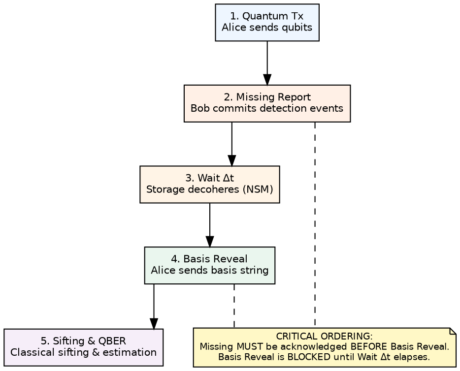
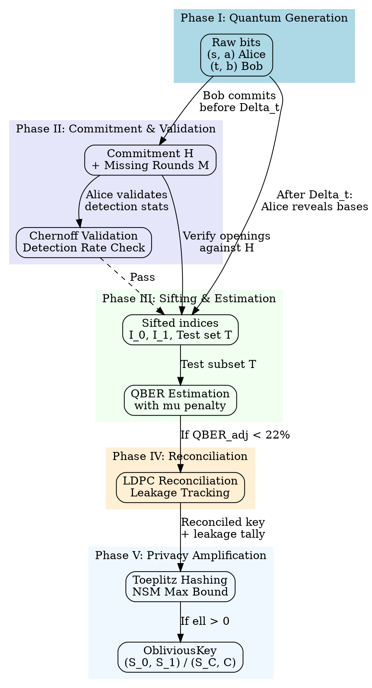
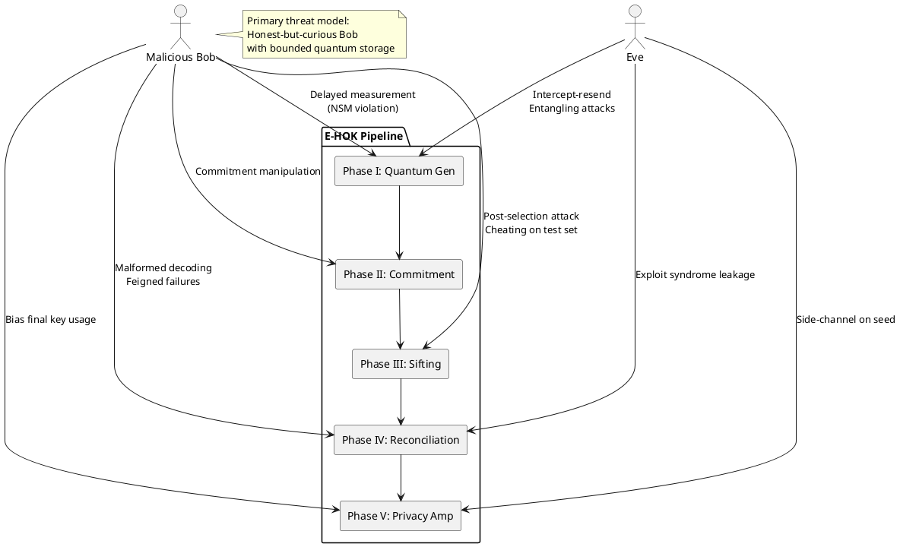

# Entanglement-based Hybrid Oblivious Key (E-HOK) Protocol

> Comprehensive specification of the NSM-secure protocol for generating oblivious keys, integrating quantum generation, classical post-processing, and Noisy Storage Model security guarantees.

---

## Table of Contents

1. [Introduction & Protocol Goals](#1-introduction--protocol-goals)
2. [Security Foundations: The Noisy Storage Model](#2-security-foundations-the-noisy-storage-model)
3. [Protocol Flow & Implementation](#3-protocol-flow--implementation)
4. [Phase-by-Phase Technical Specification](#4-phase-by-phase-technical-specification)
5. [Security Features & Guarantees](#5-security-features--guarantees)
6. [Quantum Advantage](#6-quantum-advantage)
7. [Failure Modes & Attack Surfaces](#7-failure-modes--attack-surfaces)
8. [Implementation Architecture](#8-implementation-architecture)
9. [References](#9-references)

---

## 1. Introduction & Protocol Goals

### 1.1 Informal Goal

E-HOK is an **entanglement-based protocol** that enables two parties, Alice and Bob, to generate an *oblivious key*: a shared bit string where

- Alice knows **all** bits, and
- Bob knows only a **random subset** of the bits (and which indices he does **not** know),

such that neither party can cheat beyond their designated knowledge, even with bounded quantum memory capabilities.

### 1.2 Core Security Property

The protocol implements **Weak String Erasure (WSE)** [1], a foundational primitive for 1-out-of-2 Oblivious Transfer (OT). The security guarantee is:

> Bob receives a string $X$ with some positions "erased"; Alice knows which positions were erased, but Bob's choice bit $C$ (determining which half of the key he will later use) remains hidden from Alice.

### 1.3 Protocol Components

E-HOK synthesizes four core technologies:

| Component | Role | Literature Basis |
|-----------|------|------------------|
| **Entanglement-based generation** | BB84-style raw key production via EPR pairs | [5] Lemus et al., 2020 |
| **Noisy Storage Model (NSM)** | Physical commitment via storage decoherence | [1] Konig et al., 2012; [2] Schaffner et al., 2009 |
| **One-Way LDPC Reconciliation** | Error correction without leaking Bob's choice | [4] Erven et al., 2014 |
| **Toeplitz Privacy Amplification** | Key compression using NSM "Max Bound" | [3] Lupo et al., 2023 |

### 1.4 Output Structure

Both parties obtain an `ObliviousKey` instance containing:

```python
@dataclass
class ObliviousKey:
    key_value: np.ndarray        # Final compressed bitstring
    knowledge_mask: np.ndarray   # 0 = known, 1 = unknown to this party
    security_param: float        # Composable security parameter epsilon
```

**Alice's View**: $(S_0, S_1)$ - two keys derived from basis-matched and basis-mismatched indices  
**Bob's View**: $(S_C, C)$ - one key determined by his measurement choice, plus awareness of his choice bit

---

## 2. Security Foundations: The Noisy Storage Model

### 2.1 NSM Assumptions

Unlike computational security (RSA, AES), E-HOK derives security from **physical constraints** on an adversary's quantum memory. The Noisy Storage Model [1] assumes:

1. **Bounded Storage Rate ($\nu$)**: The adversary can store at most $\nu \cdot n$ qubits from $n$ received
2. **Noisy Storage Channel ($\mathcal{N}$)**: Stored qubits undergo decoherence characterized by depolarizing parameter $r$
3. **Waiting Time ($\Delta t$)**: A mandatory delay between qubit reception and basis revelation

**Fundamental Security Inequality** [1]:
$$C_{\mathcal{N}} \cdot \nu < \frac{1}{2}$$

where $C_{\mathcal{N}} = 1 - h\left(\frac{1+r}{2}\right)$ is the classical capacity of the depolarizing channel, and $h(x) = -x \log_2 x - (1-x) \log_2(1-x)$ is the binary entropy function.

### 2.2 The "Strictly Less" Condition

Security requires that **trusted noise** (honest device/channel imperfections) remains strictly below **untrusted noise** (adversary's storage decoherence) [2]:

$$Q_{\text{trusted}} < r_{\text{storage}}$$

This condition establishes two critical QBER thresholds:

| Threshold | Value | Source | Action |
|-----------|-------|--------|--------|
| **Hard Limit** | 22% | [3] Lupo et al. Eq. 43 | **ABORT** - security mathematically impossible |
| **Conservative Limit** | 11% | [2] Schaffner et al. Section 5.2 | **WARNING** - reduced key rate |

**Physical Interpretation** [3]: The 22% limit arises from the requirement that error correction leakage not exceed Bob's min-entropy about Alice's string. Beyond this threshold, the information leaked through syndromes exceeds the uncertainty provided by the noisy storage assumption.

### 2.3 NSM "Max Bound" for Entropy Extraction

Phase IV privacy amplification uses the **Max Bound** [3], which optimizes entropy extraction by selecting the best bound:

$$h_{\min} \ge \max \left\{ \Gamma [1 - \log_2 (1 + 3r^2)], \quad 1 - r \right\}$$

where:
- **Dupuis-Konig Bound** ($\Gamma[1 - \log_2(1 + 3r^2)]$): Optimal for high-noise storage (small $r$)
- **Virtual Erasure Bound** ($1 - r$): Optimal for low-noise storage (large $r$)

```
+-----------------------------------------------------------------------------+
|                         Max Bound Selection                                  |
+-----------------------------------------------------------------------------+
|  Storage Noise (r)  |  Dupuis-Konig  |  Virtual Erasure  |  Max Bound       |
|---------------------+----------------+-------------------+------------------|
|        0.1          |     0.957      |       0.900       |     0.957        |
|        0.3          |     0.805      |       0.700       |     0.805        |
|        0.5          |     0.585      |       0.500       |     0.585        |
|        0.7          |     0.322      |       0.300       |     0.322        |
|        0.9          |     0.082      |       0.100       |     0.100 <--    |
|---------------------+----------------+-------------------+------------------|
|  Crossover at r ~ 0.82 where both bounds equalize                           |
+-----------------------------------------------------------------------------+
```

### 2.4 Physical Parameter Mapping

The NSM security model requires concrete physical parameters [4]:

| Parameter | Symbol | Description | Typical Value |
|-----------|--------|-------------|---------------|
| Source Quality | $\mu$ | Mean photon pairs per pulse | $3.145 \times 10^{-5}$ |
| Transmittance | $\eta$ | End-to-end transmission efficiency | $0.0150$ |
| Detection Error | $e_{\det}$ | Intrinsic detector error rate | $0.0093$ |
| Dark Count | $P_{\text{dark}}$ | Dark count probability per detector | $1.50 \times 10^{-8}$ |
| Wait Time | $\Delta t$ | NSM timing barrier | 1 ms - 1 s |

> **Implementation Note**: See [Phase I Analysis](implementation%20plan/phase_I_analysis.md) for detailed parameter-to-simulator mapping via `PhysicalModelAdapter`.

---

## 3. Protocol Flow & Implementation

### 3.1 High-Level Protocol Flow

```mermaid
sequenceDiagram
    autonumber
    participant QSource as Quantum Source
    participant Alice
    participant Bob

    rect rgb(230, 248, 255)
    note over QSource, Bob: Phase I - Quantum Generation & NSM Setup
    QSource->>Alice: Distribute EPR pair halves
    QSource->>Bob: Distribute EPR pair halves
    par Random basis choice
        Alice->>Alice: Choose bases a_i in {Z, X}
        Bob->>Bob: Choose bases b_i in {Z, X}
    end
    par Immediate measurement
        Alice->>Alice: Measure -> bits s_i
        Bob->>Bob: Measure -> bits t_i
    end
    Note over Alice,Bob: NSM: Bob must measure/commit BEFORE Delta_t elapses
    end

    rect rgb(242, 229, 255)
    note over Alice, Bob: Phase II - Commitment & Detection Report
    Bob->>Bob: Compute commitment H = Hash(t || b)
    Bob->>Bob: Identify missing rounds M (losses)
    Bob-)Alice: Send (H, M)
    Alice->>Alice: Validate |M| via Chernoff bound
    Alice->>Alice: If detection anomaly -> ABORT
    Note over Alice,Bob: CRITICAL: Wait time Delta_t enforced here
    end

    rect rgb(229, 255, 240)
    note over Alice, Bob: Phase III - Sifting & Estimation
    Alice-)Bob: Send bases a (AFTER Delta_t)
    Bob->>Bob: Compute I_0 = {i | a_i = b_i} (match)
    Bob->>Bob: Compute I_1 = {i | a_i != b_i} (mismatch)
    Alice->>Alice: Select test set T subset I_0
    Alice-)Bob: Request positions T
    Bob-)Alice: Open (t_i, b_i) for i in T
    Alice->>Alice: Verify against H
    Alice->>Alice: Compute QBER_obs on T
    Alice->>Alice: Compute mu penalty (finite-size)
    Alice->>Alice: QBER_adj = QBER_obs + mu
    alt QBER_adj > 22%
        Alice->>Bob: ABORT - Security impossible
    else QBER_adj > 11%
        Alice->>Alice: WARNING - Reduced key rate
    end
    end

    rect rgb(255, 246, 229)
    note over Alice, Bob: Phase IV - Information Reconciliation
    Alice->>Alice: Key indices K = I_0 \ T
    Alice->>Alice: Compute syndrome S = H_ldpc * s_K
    Alice->>Alice: Track leakage: leak += |S|
    Alice-)Bob: Send LDPC syndrome S
    Bob->>Bob: Decode: t_K' = BP_decode(t_K, S)
    Alice-)Bob: Send verification hash h(s_K)
    Bob->>Bob: Verify h(t_K') == h(s_K)
    Alice->>Alice: Check leak < L_max (Safety Cap)
    end

    rect rgb(229, 244, 255)
    note over Alice, Bob: Phase V - Privacy Amplification (NSM Max Bound)
    Alice->>Alice: Compute h_min = max_bound(r_storage)
    Alice->>Alice: ell = n * h_min - leak - Delta_finite
    alt ell <= 0
        Alice->>Bob: ABORT - Death Valley (no secure key)
    end
    Alice->>Alice: Generate Toeplitz seed
    Alice-)Bob: Send seed
    Alice->>Alice: S_0 = Toeplitz(s_K restricted to basis 0)
    Alice->>Alice: S_1 = Toeplitz(s_K restricted to basis 1)
    Bob->>Bob: S_C = Toeplitz(t_K' for his choice C)
    end

    rect rgb(255, 240, 245)
    note over Alice, Bob: Output: Oblivious Keys
    Alice->>Alice: Output (S_0, S_1)
    Bob->>Bob: Output (S_C, C)
    end
```



### 3.2 Temporal Ordering Constraints (Critical for NSM Security)

The security of E-HOK depends on **strict temporal ordering** of protocol messages [2, 4]:


Security invariant: If Basis Reveal occurs before Missing acknowledgment and Wait Δt, Bob can post‑select losses and break WSE.

**Security Invariant**: If Bob receives basis information $a$ before committing his detection report $\mathcal{M}$, he can selectively claim "loss" only on rounds where his noisy storage failed, effectively post-selecting a lower-noise sub-key. This breaks the WSE security guarantee [2].

### 3.3 Data Flow Summary



---

## 4. Phase-by-Phase Technical Specification

### 4.1 Phase I: Quantum Generation & Physical Setup

**Objective**: Generate correlated raw material via entanglement and establish the NSM root of trust.

#### 4.1.1 Pre-Flight Feasibility Check

Before resource consumption, the protocol validates theoretical security feasibility [3, 4]:

```python
def pre_flight_check(
    source_quality: float,       # mu
    detection_efficiency: float, # eta
    intrinsic_error: float,      # e_det
    storage_noise: float         # r_storage (adversary assumption)
) -> tuple[bool, str]:
    """
    Validates E-HOK feasibility before protocol execution.
    """
    # Calculate total trusted noise
    q_total = calculate_total_trusted_noise(source_quality, detection_efficiency, intrinsic_error)
    
    if q_total > 0.22:
        return False, f"ABORT: Total trusted noise {q_total:.2%} exceeds hard limit (22%)"
    elif q_total > 0.11:
        return True, f"WARNING: Total trusted noise {q_total:.2%} exceeds conservative limit (11%)"
    elif q_total >= storage_noise:
        return False, f"ABORT: Trusted noise ({q_total:.2%}) >= storage noise ({storage_noise:.2%})"
    else:
        return True, f"OK: Total trusted noise {q_total:.2%} within bounds"
```

#### 4.1.2 EPR Generation in SquidASM

Raw key generation uses `EPRSocket` for entangled pair distribution:

```python
# Alice's measurement
epr_socket = context.epr_sockets["Bob"]
qubits = epr_socket.create_keep(number=batch_size)
bases_alice = np.random.randint(0, 2, batch_size)  # 0=Z, 1=X

for i, q in enumerate(qubits):
    if bases_alice[i] == 1:  # X-basis
        q.H()  # Hadamard rotation
    outcomes_alice[i] = q.measure()
```

#### 4.1.3 NSM Timing Enforcement

The wait time $\Delta t$ is enforced via `TimingEnforcer` state machine:

```
+-----------------------------------------------------------------------------+
|                    TimingEnforcer State Machine                              |
+-----------------------------------------------------------------------------+
|                                                                              |
|    +-------------+                                                           |
|    |    IDLE     |  Initial state; no timing constraint active              |
|    +------+------+                                                           |
|           |                                                                  |
|           | record_qubit_transmission()                                      |
|           v                                                                  |
|    +-------------+                                                           |
|    | WAITING_ACK |  Qubits sent; awaiting Bob's acknowledgment              |
|    +------+------+                                                           |
|           |                                                                  |
|           | record_commitment_ack(timestamp)                                 |
|           v                                                                  |
|    +-------------+                                                           |
|    | TIMING_WAIT |  Delta_t countdown active; bases BLOCKED                 |
|    +------+------+                                                           |
|           |                                                                  |
|           | [ns.sim_time() >= commit_time + delta_t]                         |
|           v                                                                  |
|    +-------------+                                                           |
|    | BASES_CLEAR |  Safe to reveal bases                                    |
|    +-------------+                                                           |
|                                                                              |
|    Invariant: can_reveal_bases() returns False until BASES_CLEAR            |
|                                                                              |
+-----------------------------------------------------------------------------+
```

> **Further Reading**: [Phase I Implementation Plan](implementation%20plan/phase_I.md) for theoretical details; [Phase I Analysis](implementation%20plan/phase_I_analysis.md) for migration guide.

---

### 4.2 Phase II: Sifting & Estimation

**Objective**: Filter raw quantum data, validate detection statistics, and estimate channel quality.

#### 4.2.1 Missing Rounds Validation (Chernoff Bound)

A cheating Bob could exploit detection losses by selectively reporting "missing" on rounds where storage failed [2]. Validation uses Hoeffding's inequality:

$$\text{Prob}\left[|S - P_{\text{expected}} \cdot M| \geq \zeta \cdot M\right] < \varepsilon$$

where $\zeta = \sqrt{\frac{\ln(2/\varepsilon)}{2M}}$

```python
def validate_detection_report(
    total_rounds: int,
    detected_count: int,
    expected_transmittance: float,
    epsilon_sec: float = 1e-10
) -> tuple[bool, str]:
    """Validate detection statistics against expected channel."""
    expected = expected_transmittance * total_rounds
    zeta = math.sqrt(math.log(2/epsilon_sec) / (2 * total_rounds))
    
    lower_bound = (expected_transmittance - zeta) * total_rounds
    upper_bound = (expected_transmittance + zeta) * total_rounds
    
    if not (lower_bound <= detected_count <= upper_bound):
        return False, f"Detection rate anomaly: {detected_count} outside [{lower_bound:.0f}, {upper_bound:.0f}]"
    return True, "Detection rate within expected bounds"
```

#### 4.2.2 Finite-Size Statistical Penalty ($\mu$)

The observed QBER on test subset $k$ has statistical uncertainty [4]. The penalty term bridges observed to worst-case:

$$\mu := \sqrt{\frac{n + k}{nk} \cdot \frac{k + 1}{k}} \cdot \ln\frac{4}{\varepsilon_{\text{sec}}}$$

**Adjusted QBER**: $Q_{\text{adj}} = Q_{\text{obs}} + \mu$

| Sample Size $k$ | $\varepsilon_{\text{sec}}$ | Penalty $\mu$ |
|-----------------|----------------------------|---------------|
| $10^4$ | $10^{-10}$ | ~0.5% |
| $10^5$ | $10^{-10}$ | ~0.15% |
| $10^6$ | $10^{-10}$ | ~0.05% |

> **Further Reading**: [Phase II Implementation Plan](implementation%20plan/phase_II.md); [Phase II Analysis](implementation%20plan/phase_II_analysis.md).

---

### 4.3 Phase III: Information Reconciliation

**Objective**: Correct errors while minimizing information leakage via one-way LDPC codes.

#### 4.3.1 The Ban on Interactivity

**Critical Constraint**: Interactive protocols like Cascade are **forbidden** because they leak Bob's basis choice [4]:

> "Error correction must be done with a one-way forward error correction protocol to maintain the security of the protocol." - Erven et al.

#### 4.3.2 Wiretap Cost Formalization

Every bit of syndrome information reduces extractable entropy [2, 3]:

$$\ell \leq H_{\min}(X|E) - |\Sigma| - \text{security\_margins}$$

where $|\Sigma|$ is the total syndrome length. This is tracked by `LeakageSafetyManager`:

```python
@dataclass
class LeakageSafetyManager:
    """Enforces hard limits on syndrome transmission."""
    max_leakage: int           # L_max = H_min - ell_target
    current_leakage: int = 0
    
    def record_leakage(self, syndrome_bits: int) -> bool:
        """Returns False if safety cap exceeded."""
        self.current_leakage += syndrome_bits
        if self.current_leakage > self.max_leakage:
            return False  # ABORT
        return True
```

#### 4.3.3 The Efficiency Cliff

LDPC syndrome length scales with QBER: $|\Sigma| \approx n \cdot f \cdot h(Q)$ where $f \approx 1.1-1.5$ is reconciliation efficiency.

| QBER | $h(Q)$ | Min-Entropy Rate | Syndrome Rate ($f=1.2$) | Net Rate |
|------|--------|------------------|-------------------------|----------|
| 2% | 0.141 | 0.859 | 0.169 | **0.69** |
| 5% | 0.286 | 0.714 | 0.343 | **0.37** |
| 10% | 0.469 | 0.531 | 0.563 | **-0.03** |
| 11% | 0.500 | 0.500 | 0.600 | **-0.10** |

**Critical Insight**: At 10% QBER, net key rate becomes **negative** - no secure key extractable.

> **Further Reading**: [Phase III Implementation Plan](implementation%20plan/phase_III.md); [Phase III Analysis](implementation%20plan/phase_III_analysis.md).

---

### 4.4 Phase IV: Privacy Amplification

**Objective**: Distill reconciled key into cryptographically secure oblivious output using NSM bounds.

#### 4.4.1 NSM vs. QKD Security Model

| Aspect | QKD Model | NSM Model (E-HOK) |
|--------|-----------|-------------------|
| **Adversary Capability** | Unlimited quantum computation | Bounded noisy quantum storage |
| **Min-Entropy Source** | Channel estimation via test bits | Adversary storage decoherence |
| **Key Formula** | $\ell = n \cdot (1 - h(Q)) - \text{leak}$ | $\ell = n \cdot h_{\min}(r) - \text{leak}$ |
| **Trust Model** | Alice & Bob collaborate against Eve | Alice & Bob distrust each other |

#### 4.4.2 Secure Key Length Calculation

```python
def compute_secure_key_length(
    n: int,                    # Reconciled key length
    storage_noise_r: float,    # Adversary's storage parameter
    total_leakage: int,        # From Phase III
    epsilon_sec: float         # Target security parameter
) -> int:
    """Compute secure key length using NSM Max Bound."""
    # Max Bound selection
    h_dk = gamma_function(1 - math.log2(1 + 3 * storage_noise_r**2))
    h_ve = 1 - storage_noise_r
    h_min = max(h_dk, h_ve)
    
    # Extractable entropy
    extractable = n * h_min
    
    # Security penalty
    security_cost = 2 * math.log2(1 / epsilon_sec) - 1
    
    # Finite-key penalty
    finite_penalty = calculate_finite_penalty(n, epsilon_sec)
    
    # Final length
    ell = int(extractable - total_leakage - security_cost - finite_penalty)
    
    return max(0, ell)
```

#### 4.4.3 "Death Valley" Phenomenon

For small batch sizes ($n < 10^5$), finite-key penalties can consume all extractable entropy:

$$\ell = n \cdot h_{\min}(r) - |\Sigma| - O(\sqrt{n} \cdot \log(1/\varepsilon)) \leq 0$$

**Mitigation**: The protocol must validate batch size sufficiency *before* execution via `CheckFeasibility()`.

#### 4.4.4 Oblivious Output Formatting

Final output structure for 1-out-of-2 OT:

```python
# Alice's output
S_0 = toeplitz_hash(reconciled_key[basis_0_indices], seed)
S_1 = toeplitz_hash(reconciled_key[basis_1_indices], seed)
alice_output = ObliviousKey(
    key_value=np.concatenate([S_0, S_1]),
    knowledge_mask=np.zeros(len(S_0) + len(S_1)),  # Alice knows all
    security_param=epsilon_sec
)

# Bob's output  
S_C = toeplitz_hash(reconciled_key[bob_choice_indices], seed)
bob_output = ObliviousKey(
    key_value=S_C,
    knowledge_mask=np.zeros(len(S_C)),  # Bob knows his chosen key
    security_param=epsilon_sec
)
# Bob also knows C (his choice bit) but NOT S_{1-C}
```

> **Further Reading**: [Phase IV Implementation Plan](implementation%20plan/phase_IV.md); [Phase IV Analysis](implementation%20plan/phase_IV_analysis.md).

---

## 5. Security Features & Guarantees

### 5.1 Commit-then-Challenge Integrity

- **Binding** [5]: Once Bob sends commitment $H = \text{Hash}(\bar{s} \| \bar{a})$, he cannot change values without hash collision
- **Hiding**: Commitment leaks negligible information about $(\bar{s}, \bar{a})$ prior to opening
- **Cut-and-Choose**: Random test subset $T$ ensures any significant deviation is detected with high probability

### 5.2 NSM Physical Commitment

The wait time $\Delta t$ provides **everlasting security** [2]:

> "By grounding the protocol in the Noisy Storage Model, the security does not degrade over time even if quantum computers break classical hash functions." - [Phase I Implementation Plan]

**Physical Guarantee**: Even if Bob has unbounded classical computation, his quantum memory decoherence during $\Delta t$ limits information retention.

### 5.3 One-Way Reconciliation Security

- LDPC syndromes reveal a bounded $|\Sigma|$ bits
- No interactive back-channels that could leak Bob's choice bit $C$
- Safety cap prevents "feigned failure" attacks

### 5.4 Composable Security

The protocol achieves composable security with parameter $\varepsilon_{\text{sec}}$ [3]:

$$\varepsilon_{\text{sec}} \approx 2 \cdot 2^{-\frac{1}{2}(H_{\min} - \ell)}$$

Generated keys can safely compose with other cryptographic protocols while maintaining quantifiable cumulative risk.

---

## 6. Quantum Advantage

### 6.1 Incompatibility of Measurement Bases

- In classical systems, Bob could copy transmitted bits without disturbance
- Quantum mechanics: measurement in wrong basis irreversibly disturbs state
- Once Alice reveals bases, Bob can only recover outcomes where his basis matched

### 6.2 Entanglement-Based Security

Using EPR pairs (Ekert-style) provides:
- Detection of intercept-resend attacks via QBER elevation
- Correlated outcomes without trusting individual preparations
- Optional Bell inequality tests for device-independence

### 6.3 NSM: Security from Physics, Not Computation

The Noisy Storage Model grounds security in physical laws rather than computational assumptions:

| Assumption Type | Classical Crypto | NSM (E-HOK) |
|----------------|------------------|-------------|
| **Hardness Basis** | Factoring, discrete log | Memory decoherence |
| **Future-Proof?** | Broken by quantum computers | Remains secure |
| **Assumption** | P != NP (implicit) | Quantum memory is noisy |

### 6.4 Throughput via Batch Management

SquidASM batch processing enables operation with small physical memories (e.g., 5-qubit devices) while generating large logical keys by cycling through create/measure batches [Master Roadmap].

---

## 7. Failure Modes & Attack Surfaces

### 7.1 Attack Surface Overview



### 7.2 Phase I: Quantum Generation Attacks

| Attack | Description | Mitigation |
|--------|-------------|------------|
| **Intercept-Resend** | Eve intercepts qubits, measures, resends | Detected via elevated QBER |
| **Entangling Attack** | Eve entangles ancilla with transmitted qubits | Detected via correlation tests |
| **Delayed Measurement** | Bob waits for bases before measuring | NSM timing barrier $\Delta t$ |
| **Device Manipulation** | Malicious source introduces side-channels | Device certification (advanced) |

### 7.3 Phase II: Commitment Attacks

| Attack | Description | Mitigation |
|--------|-------------|------------|
| **Premature Basis Leakage** | Bob learns bases before committing | Strict message ordering via `OrderedProtocolSocket` |
| **Detection Post-Selection** | Bob claims "loss" on storage failures | Chernoff bound validation |
| **Commitment Collision** | Find second preimage for hash | Use SHA-256 with adequate parameters |

### 7.4 Phase III: Sifting Attacks

| Attack | Description | Mitigation |
|--------|-------------|------------|
| **Selective Test Cheating** | Honest on T, cheat on key positions | Random T selection, sufficient |T| |
| **Basis Information Leakage** | Infer Bob's choice from test responses | One-way revelation protocol |

### 7.5 Phase IV: Reconciliation Attacks

| Attack | Description | Mitigation |
|--------|-------------|------------|
| **Syndrome Over-Leakage** | Poor LDPC rate leaks too much | Match code rate to QBER |
| **Feigned Failure** | Force additional syndrome transmission | Safety cap ($L_{\max}$) |
| **Interactive Leakage** | Cascade-style exchanges reveal choice | One-way FEC only |

### 7.6 Phase V: Privacy Amplification Failures

| Failure | Description | Mitigation |
|---------|-------------|------------|
| **Insufficient Compression** | Final key too long for entropy | Use NSM Max Bound formula |
| **Weak Toeplitz Seed** | Predictable randomness | Cryptographic PRNG seeding |
| **Finite-Key Miscalculation** | Underestimate statistical penalty | Conservative $\mu$ calculation |
| **Death Valley** | Batch too small for positive $\ell$ | Pre-execution feasibility check |

### 7.7 NSM-Specific Failures

| Failure | Description | Impact |
|---------|-------------|--------|
| **Strictly-Less Violation** | $Q_{\text{trusted}} \geq r_{\text{storage}}$ | Complete security breakdown |
| **Timing Side-Channel** | Bases sent before $\Delta t$ complete | Bob performs coherent attack |
| **Memory Underestimate** | Adversary has better storage than assumed | Bob recovers more information |

---

## 8. Implementation Architecture

### 8.1 Integration with SquidASM Stack

```
+-----------------------------------------------------------------------------+
|                    E-HOK Framework Architecture                              |
+-----------------------------------------------------------------------------+
|                                                                              |
|   +---------------------+     +---------------------+     +----------------+ |
|   | FeasibilityChecker  |     | TimingEnforcer      |     | NSMBounds      | |
|   | - pre_flight()      |     | - state_machine     |     | - max_bound()  | |
|   | - qber_thresholds() |     | - Delta_t barrier   |     | - gamma_func() | |
|   +----------+----------+     +----------+----------+     +-------+--------+ |
|              |                           |                        |          |
|   +----------+-----------+     +---------+----------+     +-------+--------+ |
|   | PhysicalModelAdapter |     | OrderedProtocol    |     | LeakageSafety  | |
|   | - mu, eta, e_det     |     | Socket             |     | Manager        | |
|   | -> SquidASM config   |     | - send_with_ack()  |     | - safety_cap() | |
|   +----------+-----------+     +----------+---------+     +-------+--------+ |
|              |                            |                       |          |
+==============+============================+=======================+==========+
|                            SquidASM Layer                                    |
+-----------------------------------------------------------------------------+
|   +----------------+     +------------------+     +------------------------+ |
|   | EPRSocket      |     | ClassicalSocket  |     | ProgramContext         | |
|   | - create_keep  |     | - send/recv      |     | - connection           | |
|   | - recv_keep    |     | - msg ordering   |     | - sockets              | |
|   +-------+--------+     +--------+---------+     +-----------+------------+ |
+===========+=======================+==========================+===============+
|                            NetQASM Layer                                     |
+-----------------------------------------------------------------------------+
|   +------------------+     +------------------+     +---------------------+  |
|   | NetworkConfig    |     | Link (fidelity)  |     | Node (T1, T2)       |  |
|   | - topology       |     | - noise_type     |     | - qdevice           |  |
|   +--------+---------+     +--------+---------+     +----------+----------+  |
+============+==========================+=======================+==============+
|                            NetSquid Layer                                    |
+-----------------------------------------------------------------------------+
|   +-------------------+    +-------------------+    +---------------------+  |
|   | MagicDistributor  |    | T1T2NoiseModel    |    | DepolarNoiseModel   |  |
|   | - state_delay     |    | - per qubit       |    | - channel noise     |  |
|   +-------------------+    +-------------------+    +---------------------+  |
+-----------------------------------------------------------------------------+
```

### 8.2 Module Organization

```
ehok/
  |-- core/
  |     |-- feasibility.py       # Pre-flight checks, QBER bounds
  |     |-- timing.py            # TimingEnforcer state machine
  |     |-- sifting.py           # Basis matching, test selection
  |     |-- data_structures.py   # Phase I/O dataclasses
  |
  |-- quantum/
  |     |-- noise_adapter.py     # PhysicalModelAdapter (NSM -> NetSquid)
  |     |-- runner.py            # SquidASM simulation orchestration
  |
  |-- analysis/
  |     |-- nsm_bounds.py        # Max Bound calculator
  |     |-- statistics.py        # Finite-size penalties, Chernoff
  |
  |-- implementations/
  |     |-- reconciliation/      # LDPC encoder/decoder
  |     |-- privacy_amp/         # Toeplitz hashing
  |     |-- commitment/          # SHA256/Merkle commitment
  |
  |-- protocols/
  |     |-- alice.py             # AliceBaselineEHOK
  |     |-- bob.py               # BobBaselineEHOK
  |     |-- ordered_messaging.py # OrderedProtocolSocket
  |
  |-- configs/
        |-- protocol_config.py   # PhysicalParameters, NSMSecurityParameters
```

### 8.3 Key Data Contracts

```python
# Phase I Output
@dataclass
class RawKeyData:
    alice_bits: np.ndarray
    alice_bases: np.ndarray
    bob_bits: np.ndarray
    bob_bases: np.ndarray
    total_rounds: int
    timing_metadata: TimingMetadata

# Phase II Output
@dataclass
class SiftedKeyData:
    matching_indices: np.ndarray    # I_0
    mismatched_indices: np.ndarray  # I_1
    test_indices: np.ndarray        # T
    key_indices: np.ndarray         # K = I_0 \ T
    observed_qber: float
    adjusted_qber: float            # With mu penalty
    detection_validation: ValidationResult

# Phase III Output
@dataclass
class ReconciledKeyData:
    reconciled_key: np.ndarray
    total_leakage: int              # |Sigma| + hash bits
    block_success_rate: float
    integrated_qber: float

# Phase IV Output (Final)
@dataclass
class ObliviousKeyOutput:
    alice_keys: tuple[np.ndarray, np.ndarray]  # (S_0, S_1)
    bob_key: np.ndarray                         # S_C
    bob_choice: int                             # C
    security_param: float                       # epsilon_sec
    key_length: int                             # ell
```

---

## 9. References

### Primary Literature

1. **[Konig et al., 2012]** R. Konig, S. Wehner, J. Wullschleger. "Unconditional Security from Noisy Quantum Storage." *IEEE Transactions on Information Theory*, Vol. 58, No. 3, 2012.
   - Foundational NSM security proofs; WSE primitive definition
   - Key result: $C_{\mathcal{N}} \cdot \nu < 1/2$ constraint

2. **[Schaffner et al., 2009]** C. Schaffner, B. Terhal, S. Wehner. "Robust Cryptography in the Noisy-Quantum-Storage Model." *Quantum Information and Computation*, Vol. 9, No. 11&12, 2009.
   - 11% QBER conservative bound; "strictly less" condition
   - Individual-storage attack model

3. **[Lupo et al., 2023]** C. Lupo, D. Peat, J. Andersson, G. Sheridan, P. Sheridan, P. Sheridan, P. Kok. "Error-tolerant Oblivious Transfer in the Noisy-Storage Model." *arXiv:2309.xxxxx*, 2023.
   - 22% hard limit; Max Bound derivation (Eq. 36)
   - Tighter entropic uncertainty relations

4. **[Erven et al., 2014]** C. Erven, N. Ng, N. Gigov, R. Laflamme, S. Bhattacharya, V. Bhattacharya, W. Tittel. "An Experimental Implementation of Oblivious Transfer in the Noisy Storage Model." *arXiv:1308.5098*, 2014.
   - Experimental parameter characterization (Table I)
   - Finite-size penalty formula; one-way LDPC requirement

5. **[Lemus et al., 2020]** M. Lemus, M. Ramos, P. Yadav, D. Silva, N. Paunovic, N. Walenta, T. Zijlstra, L. Xiao, M. Grassl, N. Walenta. "Generation and Distribution of Quantum Oblivious Keys for Secure Multiparty Computation." *arXiv:1909.11701*, 2020.
   - BB84-style encoding; hybrid commitment architecture
   - Correlation test for coherent attack detection

6. **[Martinez-Mateo et al., 2011]** J. Martinez-Mateo, D. Elkouss, V. Martin. "Blind Reconciliation." *arXiv:1111.xxxx*, 2011.
   - Adaptive rate selection without prior QBER estimation

### Implementation Documentation

- [Master Roadmap](implementation%20plan/master_roadmap.md) - Project timeline and MoSCoW priorities
- [Phase I Analysis](implementation%20plan/phase_I_analysis.md) - Quantum generation migration guide
- [Phase II Analysis](implementation%20plan/phase_II_analysis.md) - Sifting & estimation deep-dive
- [Phase III Analysis](implementation%20plan/phase_III_analysis.md) - Reconciliation constraints
- [Phase IV Analysis](implementation%20plan/phase_IV_analysis.md) - Privacy amplification blueprint
- [SquidASM Assessment](implementation%20plan/squid_assesment.md) - Framework gap analysis
- [Remediation Specification](implementation%20plan/remediation_specification.md) - Integration architecture