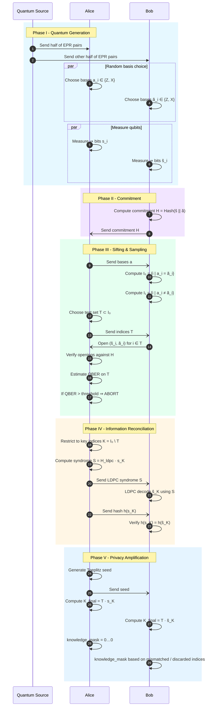
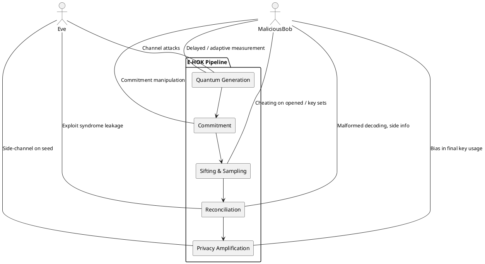
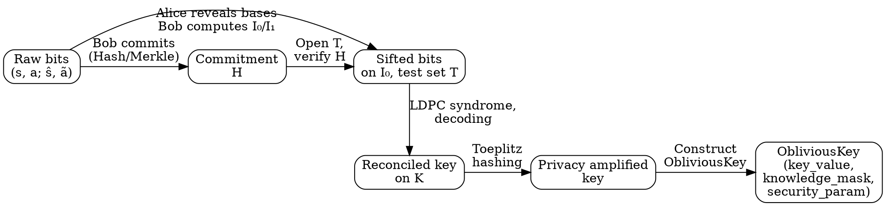

# Entanglement-based Hybrid Oblivious Key (E‑HOK) Overview

> High-level description of the protocol, security features, quantum advantage, and main failure modes.

## 1. Informal Goal

E‑HOK is an entanglement-based protocol that lets two parties, Alice and Bob, generate an *oblivious key*: a shared bit string where

- Alice knows **all** bits, and
- Bob knows only a **random subset** of the bits (and which ones he does **not** know),

such that no efficient adversary can substantially increase Bob’s knowledge beyond this subset or learn which bits Alice will later use in higher‑level oblivious transfer (OT) or secure multiparty computation (SMC) protocols.

At a high level, E‑HOK combines:

- entanglement-based QKD-style raw key generation,
- classical commitment and sampling (cut‑and‑choose),
- LDPC-based information reconciliation, and
- Toeplitz-matrix privacy amplification,

into a single pipeline that outputs an `ObliviousKey` object.

---

## 2. High-level Protocol Flow

### 2.1 Textual overview

1. **Quantum generation (Raw key):**
   - A source creates entangled qubit pairs distributed to Alice and Bob.
   - Each party randomly chooses a measurement basis (Z or X) for each qubit and measures immediately.
   - They obtain raw bit strings and corresponding basis strings: $(s, a)$ for Alice and $(\bar{s}, \bar{a})$ for Bob.

2. **Commitment (Trust anchor):**
   - Before seeing Alice’s bases, Bob *commits* to all of his raw measurement results and bases.
   - In the baseline, this is a SHA‑256 hash (optionally Merkle‑tree based for scalability).

3. **Sifting & sampling (Integrity and channel estimation):**
   - Alice reveals her basis string $a$.
   - Bob discovers indices with matching bases ($I_0$) and mismatches ($I_1$).
   - Alice randomly selects a test subset $T \subset I_0$ and requests Bob to *open* those positions.
   - Alice checks consistency with the commitment and estimates the quantum bit error rate (QBER) on $T$.
   - If QBER exceeds the threshold, the protocol aborts.

4. **Information reconciliation (Error correction):**
   - On the remaining indices $I_0 \setminus T$, Alice and Bob hold *sifted* but noisy correlated bits.
   - Alice sends an LDPC syndrome of her string; Bob decodes to correct his bits.
   - They exchange a short hash to confirm agreement on the corrected key.

5. **Privacy amplification (Key distillation):**
   - Using a random Toeplitz matrix (seeded by Alice), they compress the reconciled key to a shorter, near-uniform string.
   - Alice’s `knowledge_mask` is all zeros; Bob’s `knowledge_mask` encodes which positions he never knew (corresponding essentially to $I_1$ after all classical post‑processing).

6. **Output (Oblivious key):**
   - Both parties obtain an `ObliviousKey` instance with
     - `key_value` (final compressed bitstring),
     - `knowledge_mask` (0 = known, 1 = unknown),
     - `security_param` (effective security $\varepsilon$).

### 2.2 Mermaid sequence diagram (ideal honest run)

---

## 3. Security Features

This section summarizes how each phase contributes to security, at a qualitative level.

### 3.1 Commit-then-challenge integrity

- **Binding:** Once Bob sends a commitment to $(\bar{s}, \bar{a})$, he cannot change those values without finding a collision in the underlying hash (Merkle or SHA‑256).
- **Hiding:** The commitment leaks negligible information about $(\bar{s}, \bar{a})$ prior to opening, so Alice cannot bias her basis choices retrospectively.
- **Cut‑and‑choose:** The random test subset $T$ ensures that with high probability, any significant deviation from honest measurement will be detected.

### 3.2 Channel parameter estimation

- The QBER on the test subset $T$ serves as an estimator of the noise (or adversarial disturbance) on the remaining bits.
- Using classical concentration bounds (e.g. Hoeffding’s inequality), the protocol sets an abort threshold to guarantee that, except with small probability $\varepsilon_{\text{stat}}$, the unseen bits have error rate close to the observed one.

### 3.3 Information reconciliation with controlled leakage

- LDPC reconciliation reveals a *syndrome* $S$ whose length directly bounds the information leaked to any eavesdropper or to a cheating Bob about Alice’s raw key.
- In the baseline, reconciliation is **one‑way** from Alice to Bob, simplifying security reasoning (no interactive back‑channels that leak extra structure).

### 3.4 Privacy amplification and composable security

- The Toeplitz-matrix hash is a 2‑universal family; by the leftover hash lemma, compressing the reconciled key by more than the estimated leakage yields a near‑uniform secret key.
- The `security_param` in the `ObliviousKey` object encodes the residual distinguishing advantage $\varepsilon$ (how far the key is from ideal).
- Because standard QKD-style post‑processing is used, E‑HOK can be analyzed using finite‑key, composable security frameworks.

### 3.5 Oblivious structure of the key

- The distinction between $I_0$ (matching bases) and $I_1$ (mismatches) induces an *asymmetry* in knowledge:
  - Alice knows all measurement results and which indices were discarded or tested.
  - Bob’s `knowledge_mask` records where he fundamentally lacked information due to basis mismatch or deliberate discarding during post‑processing.
- This asymmetry is what enables using E‑HOK as a building block for classical OT extension and SMC.

---

## 4. Quantum Advantage

E‑HOK derives its advantage specifically from *quantum* properties of entangled states and incompatible measurements.

### 4.1 Incompatibility of bases

- In classical systems, Bob could copy any transmitted bit without disturbance.
- With qubits prepared in randomly chosen, mutually unbiased bases (e.g. Z and X), a receiver who does not know the basis must guess, irreversibly disturbing the state.
- Once Alice later reveals her basis string, Bob can only perfectly recover outcomes where he happened (by chance) to measure in the same basis.

### 4.2 Entanglement-based security

- Using entangled pairs (as in Ekert-style QKD) allows detection of certain classes of eavesdropping or device tampering by monitoring correlations and, if desired, Bell‑inequality violations.
- Even in the baseline where Bell tests may be omitted, entanglement ensures correlated outcomes suitable for key generation without trusting individual qubit preparations.

### 4.3 Noisy-storage and timing assumptions (extensions)

- In advanced variants, E‑HOK can replace classical commitments with **physical commitments** arising from noisy quantum storage:
  - If Bob attempts to delay measurement until the bases are revealed, his quantum memory decoheres.
  - A sufficiently long enforced delay $\Delta t$ relative to memory coherence times $T_1, T_2$ bounds his information, acting as a physical analogue of a binding commitment.
- This **Noisy Storage Model** (NSM) offers security rooted in physics rather than purely computational assumptions.

### 4.4 Throughput and scalability

- Batch management in SquidASM allows E‑HOK to operate with small physical memories (e.g. 5‑qubit devices) while processing large logical keys by cycling through create/measure batches.
- Classical post‑processing (LDPC, Toeplitz) is highly parallelizable and can be accelerated in specialized hardware for high key rates.

---

## 5. Main Failure Modes and Attack Surfaces

This section lists the main classes of attacks or failure modes at a high level. Concrete countermeasures depend on parameter choices, implementation details, and physical assumptions.

### 5.1 Overview diagram (attack surfaces)

### 5.2 Quantum-generation layer attacks

- **Intercept-resend / entangling attacks:**
  - An external adversary (Eve) interacts with the quantum channel to gain partial information.
  - Detected as elevated QBER or broken correlations; mitigated by aborting when QBER exceeds threshold.
- **Source or device manipulation:**
  - Imperfect or malicious sources may introduce correlations or side channels.
  - Entanglement-based designs allow some device-independence checks, but a full treatment requires advanced certification beyond the baseline.

### 5.3 Commitment and sampling attacks

- **Premature basis leakage:**
  - If Bob learns Alice’s basis choices before committing, he can tailor measurements to avoid uncertainty, breaking obliviousness.
  - The implementation must enforce the *ordering* strictly: commitment reception before basis reveal.
- **Selective cheating on key positions:**
  - Malicious Bob may behave honestly on test subset $T$ but cheat on the remaining positions.
  - Proper randomization of $T$ and sufficiently large test size make undetected cheating exponentially unlikely.
- **Commitment collisions / second preimage:**
  - Attacking the hash function itself; mitigated by using standard cryptographically secure primitives (SHA‑256, Merkle trees) with adequate parameters.

### 5.4 Reconciliation attacks

- **Syndrome leakage beyond design assumptions:**
  - If the LDPC matrix or syndrome rate is poorly chosen, the information leaked through $S$ may exceed what privacy amplification compensates for.
  - Requires careful matching of code rate, observed QBER, and final compression length.
- **Implementation bugs in decoder:**
  - Side channels (timing, memory access patterns) or incorrect failure handling can leak correlations about Alice’s bits.

### 5.5 Privacy amplification and composability issues

- **Insufficient compression:**
  - If the final key is not shortened enough to account for leakage and finite-size effects, residual correlations with an adversary remain.
- **Weak randomness in Toeplitz seed:**
  - Predictable or biased seeds can render the universal hash non‑random from the adversary’s perspective.
- **Misuse in higher-level protocols:**
  - Even if the oblivious key is secure, composing it with insecure OT‑extension or SMC implementations can reintroduce vulnerabilities; E‑HOK must be treated within a composable security framework.

### 5.6 Physical-layer and noisy-storage failures (advanced)

- **Over‑estimated decoherence / under‑estimated memory quality:**
  - If the real quantum memory is better than assumed, a cheating Bob could successfully delay measurements and recover more information than predicted.
- **Timing side channels:**
  - If enforced waits or communication delays are not accurately implemented in the simulator or hardware, the Noisy Storage guarantees can be invalidated.

---

## 6. Graphviz overview of data flow

---

## 7. Summary

- E‑HOK extends entanglement-based QKD techniques to produce *oblivious* keys suitable as seeds for classical OT extension and secure multiparty computation.
- Security arises from the combination of quantum measurement incompatibility, commitment‑then‑challenge sampling, controlled information reconciliation, and strong privacy amplification.
- The main attack surfaces are quantum channel tampering, ordering/commitment violations, over‑leaky reconciliation, and incorrect finite‑key/privacy‑amplification parameters.
- When implemented with conservative parameters and validated simulations (e.g. within SquidASM), E‑HOK provides a modular, extensible baseline for more advanced R&D features such as noisy‑storage‑based commitments, MET‑LDPC codes, and full UC‑secure OT extension.
