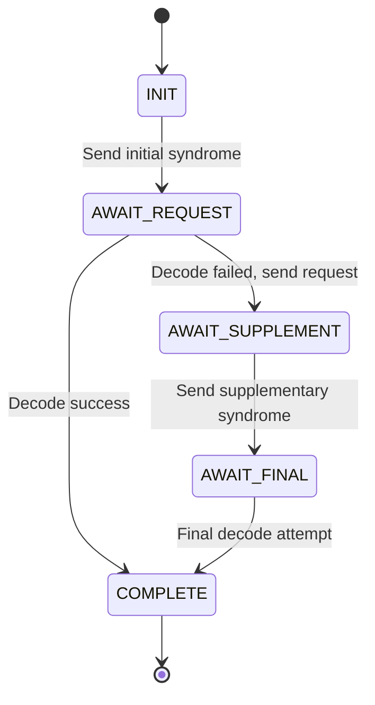

# E-HOK Noise Tolerance Review

## Technical Analysis of LDPC Reconciliation and Privacy Amplification Under Noisy Quantum Channels

**Document Version**: 1.0  
**Date**: 2025-01-XX  
**Status**: Technical Review  
**Scope**: Analysis of noise-induced failures in E-HOK post-processing pipeline

---

## Table of Contents

1. [Executive Summary](#1-executive-summary)
2. [Protocol Architecture Under Noisy Input](#2-protocol-architecture-under-noisy-input)
   - 2.1 [Data Flow Overview](#21-data-flow-overview)
   - 2.2 [Noise Propagation Model](#22-noise-propagation-model)
3. [LDPC Reconciliation: Detailed Analysis](#3-ldpc-reconciliation-detailed-analysis)
   - 3.1 [Rate Selection Mechanism](#31-rate-selection-mechanism)
   - 3.2 [Syndrome Computation](#32-syndrome-computation)
   - 3.3 [Belief-Propagation Decoder](#33-belief-propagation-decoder)
   - 3.4 [Hash Verification](#34-hash-verification)
4. [Privacy Amplification: Sensitivity Analysis](#4-privacy-amplification-sensitivity-analysis)
   - 4.1 [Leftover Hash Lemma Application](#41-leftover-hash-lemma-application)
   - 4.2 [Leakage Accounting](#42-leakage-accounting)
   - 4.3 [Finite-Key Effects](#43-finite-key-effects)
5. [Identified Failure Modes](#5-identified-failure-modes)
   - 5.1 [Primary Failure: LLR Misconfiguration](#51-primary-failure-llr-misconfiguration)
   - 5.2 [Secondary Failure: Insufficient BP Iterations](#52-secondary-failure-insufficient-bp-iterations)
   - 5.3 [Tertiary Failure: Rate Selection Inaccuracy](#53-tertiary-failure-rate-selection-inaccuracy)
   - 5.4 [Quaternary Failure: Aggressive Privacy Amplification](#54-quaternary-failure-aggressive-privacy-amplification)
6. [Theoretical Foundations from Literature](#6-theoretical-foundations-from-literature)
   - 6.1 [Post-Processing Procedure (Kiktenko et al.)](#61-post-processing-procedure-kiktenko-et-al)
   - 6.2 [Blind Reconciliation Protocol](#62-blind-reconciliation-protocol)
   - 6.3 [Tight Finite-Key Analysis](#63-tight-finite-key-analysis)
7. [Proposed Solutions](#7-proposed-solutions)
   - 7.1 [Critical Fix: Dynamic LLR Computation](#71-critical-fix-dynamic-llr-computation)
   - 7.2 [High Priority: Adaptive BP Iteration Scaling](#72-high-priority-adaptive-bp-iteration-scaling)
   - 7.3 [Medium Priority: Blind Rate Adaptation](#73-medium-priority-blind-rate-adaptation)
   - 7.4 [Medium Priority: Conservative Privacy Amplification](#74-medium-priority-conservative-privacy-amplification)
   - 7.5 [Enhancement: Soft-Decision Syndrome Decoding](#75-enhancement-soft-decision-syndrome-decoding)
8. [Implementation Roadmap](#8-implementation-roadmap)
9. [Validation Criteria](#9-validation-criteria)
10. [Appendices](#10-appendices)

---

## 1. Executive Summary

The E-HOK post-processing pipeline exhibits systematic failures under noisy quantum channel conditions (QBER ≥ 3%). Root cause analysis reveals **four interrelated failure modes**:

| Failure Mode | Severity | Root Cause | Impact |
|:-------------|:---------|:-----------|:-------|
| LLR Misconfiguration | **Critical** | Hardcoded QBER estimate in LLR computation | BP decoder receives incorrect reliability information |
| Insufficient BP Iterations | **High** | Fixed 60 iterations regardless of noise level | Decoder fails to converge for high error counts |
| Rate Selection Inaccuracy | **Medium** | Initial QBER estimate diverges from actual | Wrong code rate chosen, insufficient redundancy |
| Aggressive PA Formula | **Medium** | Standard leftover hash lemma without finite-key correction | Zero-length keys for marginal conditions |

**Key Finding**: The primary bottleneck is the LDPC decoder's use of stale QBER estimates for computing log-likelihood ratios (LLRs). When actual QBER differs significantly from the estimate, the decoder's soft-decision information is miscalibrated, leading to non-convergence even when the code rate provides sufficient redundancy.

**Recommendation**: Implement dynamic LLR computation using measured QBER, adaptive BP iteration scaling, and conservative finite-key privacy amplification.

---

## 2. Protocol Architecture Under Noisy Input

### 2.1 Data Flow Overview

The E-HOK post-processing pipeline transforms raw sifted keys into reconciled, privacy-amplified final keys through the following stages:

```
┌─────────────────────────────────────────────────────────────────────────────┐
│                        E-HOK POST-PROCESSING PIPELINE                       │
└─────────────────────────────────────────────────────────────────────────────┘

      SIFTED KEY (Alice)                         SIFTED KEY (Bob)
            │                                          │
            │  ┌──────────────────────────────────┐   │
            │  │         QBER ESTIMATION          │   │
            │  │  (Sample subset, classical comm) │   │
            │  └──────────────────────────────────┘   │
            │                   │                      │
            │         QBER_estimated ≈ 3-5%           │
            │                   │                      │
            ▼                   ▼                      ▼
    ┌───────────────────────────────────────────────────────────┐
    │                    RATE SELECTION                         │
    │                                                           │
    │   Select R such that: (1-R)/h(QBER) < f_crit = 1.22      │
    │                                                           │
    │   For QBER=5%: h(0.05) ≈ 0.286, need R < 0.65            │
    └───────────────────────────────────────────────────────────┘
                              │
                              ▼
    ┌───────────────────────────────────────────────────────────┐
    │                   BLOCK PARTITIONING                      │
    │                                                           │
    │   Frame size: N = 4096 bits                               │
    │   Number of blocks: ⌈sifted_length / 4096⌉               │
    └───────────────────────────────────────────────────────────┘
                              │
                              ▼
    ┌───────────────────────────────────────────────────────────┐
    │              FOR EACH BLOCK i = 1, ..., B                 │
    └───────────────────────────────────────────────────────────┘
                              │
                              ▼
    ┌───────────────────────────────────────────────────────────┐
    │                  SYNDROME COMPUTATION                     │
    │                                                           │
    │   Alice computes: s_A = H · x_A (mod 2)                  │
    │   Transmits s_A to Bob over authenticated classical ch.  │
    │                                                           │
    │   Leakage: |s_A| = (1-R) × 4096 bits                     │
    └───────────────────────────────────────────────────────────┘
                              │
                              ▼
    ┌───────────────────────────────────────────────────────────┐
    │                 BELIEF PROPAGATION DECODE                 │
    │                                                           │
    │   Bob computes: s_B = H · x_B                             │
    │   Error syndrome: s_e = s_A ⊕ s_B                        │
    │   Decode error vector: e = BP_decode(H, s_e, LLR)        │
    │   Corrected key: x'_B = x_B ⊕ e                          │
    │                                                           │
    │   *** CRITICAL: LLR computation uses QBER estimate ***   │
    │       LLR_i = log((1 - p) / p)  where p = QBER_est       │
    └───────────────────────────────────────────────────────────┘
                              │
                              ▼
    ┌───────────────────────────────────────────────────────────┐
    │                   HASH VERIFICATION                       │
    │                                                           │
    │   Alice computes: h_A = PolyHash(x_A)  [50 bits]         │
    │   Bob computes:   h_B = PolyHash(x'_B)                   │
    │                                                           │
    │   If h_A ≠ h_B: BLOCK FAILED (residual errors exist)     │
    │   Leakage: 50 bits per block                              │
    └───────────────────────────────────────────────────────────┘
                              │
                              ▼
    ┌───────────────────────────────────────────────────────────┐
    │               CONCATENATE VERIFIED BLOCKS                 │
    │                                                           │
    │   reconciled_key = ∥ verified_blocks                     │
    │   Total leakage = Σ(syndrome_bits + hash_bits)           │
    └───────────────────────────────────────────────────────────┘
                              │
                              ▼
    ┌───────────────────────────────────────────────────────────┐
    │                   PRIVACY AMPLIFICATION                   │
    │                                                           │
    │   Compute secure length (Leftover Hash Lemma):            │
    │                                                           │
    │   m = n × (1 - h(QBER)) - leakage - 2×log₂(1/ε) - margin │
    │                                                           │
    │   final_key = Toeplitz_hash(reconciled_key, seed)[0:m]   │
    │                                                           │
    │   If m ≤ 0: PROTOCOL ABORT (insufficient min-entropy)    │
    └───────────────────────────────────────────────────────────┘
                              │
                              ▼
                       FINAL SECURE KEY
```

### 2.2 Noise Propagation Model

Quantum channel noise manifests as bit disagreements between Alice's and Bob's sifted keys. The **Quantum Bit Error Rate (QBER)** quantifies this disagreement:

$$\text{QBER} = \frac{\text{Number of disagreeing bits}}{\text{Total sifted bits}}$$

**Noise Sources in Quantum Channel**:

| Source | Physical Mechanism | Typical Contribution |
|:-------|:-------------------|:---------------------|
| Detector dark counts | Spontaneous detection events | 0.1 - 1% |
| Polarization drift | Fiber birefringence | 0.5 - 2% |
| Timing jitter | Detector/clock synchronization | 0.5 - 1.5% |
| Background photons | Ambient light leakage | Variable |
| Eavesdropper (Eve) | Intercept-resend attacks | Indistinguishable from noise |

**Security Threshold**: For BB84-based protocols, the theoretical QBER threshold is $\text{QBER}_{\text{max}} \approx 11\%$. Above this, no secure key can be extracted under collective attacks. For finite-key scenarios, practical thresholds are lower ($\approx 8-9\%$).

**Noise Propagation Through Pipeline**:

```
QBER → Rate Selection → Syndrome Size → Decoder Load → Verification → PA Length
  │          │               │              │              │            │
  │          │               │              │              │            │
  │    Rate too high    More parity    More errors    Hash fails   Negative m
  │    for noise level  bits needed    to correct     (residual)   → Zero key
  │          │               │              │              │            │
  │          ▼               ▼              ▼              ▼            ▼
  │     WRONG CODE      UNDER-         NON-          BLOCK         PROTOCOL
  │     SELECTION       CONSTRAINED    CONVERGENCE   DISCARD       ABORT
```

---

## 3. LDPC Reconciliation: Detailed Analysis

### 3.1 Rate Selection Mechanism

The rate selection algorithm chooses an LDPC code rate $R$ to provide sufficient redundancy for error correction while maximizing throughput.

**Current Implementation** (`ldpc_reconciliator.py`):

```python
def select_rate(self, qber_estimate: float) -> float:
    """
    Select appropriate LDPC code rate based on QBER estimate.
    
    Uses the critical efficiency criterion:
        (1 - R) / h(QBER) < f_crit
    
    where f_crit = 1.22 is the reconciliation efficiency threshold.
    """
    h_qber = self._binary_entropy(qber_estimate)
    
    # Available rates: [0.50, 0.55, 0.60, 0.65, 0.70, 0.75, 0.80, 0.85, 0.90]
    for rate in self.available_rates:
        efficiency = (1 - rate) / h_qber
        if efficiency < self.f_crit:
            return rate
    
    return self.available_rates[0]  # Fallback to lowest rate
```

**Mathematical Basis**:

The binary entropy function:
$$h(p) = -p \log_2(p) - (1-p) \log_2(1-p)$$

For a code with rate $R$, the number of parity bits is $(1-R) \times n$. The Shannon limit for error correction is:
$$R_{\text{max}} = 1 - h(\text{QBER})$$

In practice, we require a margin (efficiency factor $f < 1.22$):
$$\frac{1-R}{h(\text{QBER})} < f_{\text{crit}}$$

**Rate Selection Table**:

| QBER | $h(\text{QBER})$ | Min Rate $R$ | Parity Bits (N=4096) |
|:-----|:-----------------|:-------------|:---------------------|
| 1% | 0.0808 | 0.90 | 410 |
| 2% | 0.1414 | 0.85 | 614 |
| 3% | 0.1940 | 0.75 | 1024 |
| 4% | 0.2423 | 0.70 | 1229 |
| 5% | 0.2864 | 0.65 | 1434 |
| 7% | 0.3665 | 0.55 | 1843 |
| 10% | 0.4690 | 0.50 | 2048 |

**Failure Point**: If the QBER estimate is lower than actual QBER, a rate too high is selected, providing insufficient redundancy for the decoder.

### 3.2 Syndrome Computation

Alice computes the syndrome of her key block using the parity-check matrix $H$:

$$\mathbf{s}_A = H \cdot \mathbf{x}_A \pmod{2}$$

Bob computes his syndrome and derives the error syndrome:

$$\mathbf{s}_B = H \cdot \mathbf{x}_B \pmod{2}$$
$$\mathbf{s}_e = \mathbf{s}_A \oplus \mathbf{s}_B = H \cdot (\mathbf{x}_A \oplus \mathbf{x}_B) = H \cdot \mathbf{e}$$

where $\mathbf{e}$ is the error vector (bit positions where Alice and Bob disagree).

**Current Implementation**:

```python
def compute_syndrome(self, key_block: np.ndarray, parity_matrix: np.ndarray) -> np.ndarray:
    """Compute syndrome s = H · x (mod 2)."""
    return (parity_matrix @ key_block) % 2
```

**Observation**: Syndrome computation is deterministic and correct. No failure mode exists here.

### 3.3 Belief-Propagation Decoder

The BP decoder is the core of LDPC reconciliation. It uses soft-decision information to iteratively estimate the error vector.

**Algorithm: Sum-Product Belief Propagation**

```
Input: Parity-check matrix H, error syndrome s_e, channel LLRs L_ch
Output: Estimated error vector ê

Initialize:
    For each variable node v:
        L_v = L_ch[v]  (channel LLR)
        μ_v→c = L_v for all connected check nodes c

Iterate until convergence or max_iterations:
    
    # Check node update (horizontal step)
    For each check node c:
        For each connected variable node v:
            μ_c→v = 2 × arctanh( ∏_{v' ∈ N(c)\{v}} tanh(μ_{v'→c} / 2) )
            
            # Apply syndrome constraint
            If s_e[c] = 1:
                μ_c→v = -μ_c→v  (flip sign)
    
    # Variable node update (vertical step)
    For each variable node v:
        L_v = L_ch[v] + Σ_{c ∈ N(v)} μ_c→v
        
        For each connected check node c:
            μ_v→c = L_v - μ_c→v
    
    # Decision
    ê[v] = 1 if L_v < 0 else 0
    
    # Convergence check
    If H · ê = s_e:
        Return ê (success)

Return FAILURE (non-convergence)
```

**Current Implementation** (`ldpc_bp_decoder.py`):

```python
def decode(
    self,
    parity_matrix: np.ndarray,
    syndrome: np.ndarray,
    llr_input: np.ndarray,
    max_iterations: int = 60,
    threshold: float = 1e-6
) -> Tuple[np.ndarray, bool]:
    """
    Sum-product BP decoder.
    
    Returns
    -------
    Tuple[np.ndarray, bool]
        (estimated_error, converged)
    """
    n_checks, n_vars = parity_matrix.shape
    
    # Initialize messages
    var_to_check = np.zeros((n_checks, n_vars))
    check_to_var = np.zeros((n_checks, n_vars))
    
    # Initial variable-to-check messages = channel LLRs
    for c in range(n_checks):
        for v in range(n_vars):
            if parity_matrix[c, v]:
                var_to_check[c, v] = llr_input[v]
    
    for iteration in range(max_iterations):
        # Check node update (tanh domain)
        for c in range(n_checks):
            neighbors = np.where(parity_matrix[c, :] == 1)[0]
            for v in neighbors:
                product = 1.0
                for v_prime in neighbors:
                    if v_prime != v:
                        tanh_val = np.tanh(var_to_check[c, v_prime] / 2)
                        tanh_val = np.clip(tanh_val, -0.9999999, 0.9999999)
                        product *= tanh_val
                
                check_to_var[c, v] = 2 * np.arctanh(product)
                
                # Syndrome constraint
                if syndrome[c] == 1:
                    check_to_var[c, v] = -check_to_var[c, v]
        
        # Variable node update
        total_llr = llr_input.copy()
        for c in range(n_checks):
            for v in range(n_vars):
                if parity_matrix[c, v]:
                    total_llr[v] += check_to_var[c, v]
        
        # Update variable-to-check messages
        for c in range(n_checks):
            for v in range(n_vars):
                if parity_matrix[c, v]:
                    var_to_check[c, v] = total_llr[v] - check_to_var[c, v]
        
        # Hard decision and convergence check
        estimated_error = (total_llr < 0).astype(int)
        current_syndrome = (parity_matrix @ estimated_error) % 2
        
        if np.array_equal(current_syndrome, syndrome):
            return estimated_error, True
    
    return estimated_error, False
```

**Critical Issue: LLR Computation**

The log-likelihood ratio (LLR) quantifies the reliability of each bit:

$$\text{LLR}_i = \log \frac{P(e_i = 0 | \text{observation})}{P(e_i = 1 | \text{observation})}$$

For a binary symmetric channel with crossover probability $p$ (the QBER):

$$\text{LLR}_i = \log \frac{1-p}{p}$$

**Current Implementation** (`_build_error_llrs`):

```python
def _build_error_llrs(self, block_length: int) -> np.ndarray:
    """Build initial LLRs for error estimation."""
    # BUG: Uses hardcoded estimate, not measured QBER
    current_qber_est = 0.05  # This should be the actual measured QBER!
    
    p = current_qber_est
    llr_value = np.log((1 - p) / p)  # ≈ 2.94 for p=0.05
    
    return np.full(block_length, llr_value)
```

**Impact Analysis**:

| Actual QBER | Estimated QBER | Correct LLR | Used LLR | LLR Error |
|:------------|:---------------|:------------|:---------|:----------|
| 1% | 5% | 4.60 | 2.94 | -1.66 (36% underestimate) |
| 3% | 5% | 3.48 | 2.94 | -0.54 (15% underestimate) |
| 5% | 5% | 2.94 | 2.94 | 0 (correct) |
| 7% | 5% | 2.59 | 2.94 | +0.35 (14% overestimate) |
| 10% | 5% | 2.20 | 2.94 | +0.74 (34% overestimate) |

When LLRs are **overestimated** (actual QBER > estimated), the decoder places too much confidence in the channel observations, resisting correction. When LLRs are **underestimated** (actual QBER < estimated), the decoder is overly willing to flip bits, potentially introducing new errors.

### 3.4 Hash Verification

After BP decoding, a polynomial hash verifies that the corrected block matches Alice's original:

**Current Implementation**:

```python
def verify_block(self, alice_block: np.ndarray, bob_corrected: np.ndarray) -> bool:
    """Verify using 50-bit polynomial hash."""
    alice_hash = self._polynomial_hash(alice_block, self.hash_seed)
    bob_hash = self._polynomial_hash(bob_corrected, self.hash_seed)
    return alice_hash == bob_hash
```

**Properties**:
- Hash collision probability: $2^{-50} \approx 10^{-15}$
- Leakage per block: 50 bits
- Detection capability: Any residual error causes hash mismatch with probability $\geq 1 - 2^{-50}$

**Observation**: Hash verification is correctly implemented and provides strong error detection. However, it cannot correct errors—it only flags failed blocks for discard.

---

## 4. Privacy Amplification: Sensitivity Analysis

### 4.1 Leftover Hash Lemma Application

Privacy amplification compresses the reconciled key to eliminate any information Eve may have obtained during quantum transmission and classical post-processing.

**Leftover Hash Lemma (Universal Composability Framework)**:

If $K$ is a random variable with min-entropy $H_{\min}(K|E) \geq k$ conditioned on Eve's information $E$, and $f$ is a 2-universal hash function, then:

$$\frac{1}{2} \| \rho_{f(K)E} - \rho_U \otimes \rho_E \|_1 \leq \frac{1}{2} \cdot 2^{-\frac{1}{2}(k - m)}$$

where $m$ is the output length and $\rho_U$ is the uniform distribution.

For security parameter $\varepsilon_{\text{sec}}$:

$$m \leq k - 2 \log_2 \frac{1}{\varepsilon_{\text{sec}}}$$

### 4.2 Leakage Accounting

The min-entropy of the reconciled key, conditioned on Eve's information, must account for all classical leakage:

$$H_{\min}(K|E) \approx n \cdot (1 - h(\text{QBER})) - \ell_{\text{EC}} - \ell_{\text{hash}}$$

where:
- $n$: length of reconciled key
- $h(\text{QBER})$: binary entropy at the measured QBER
- $\ell_{\text{EC}}$: syndrome bits leaked during error correction
- $\ell_{\text{hash}}$: verification hash bits leaked

**Current Implementation** (`compute_final_length`):

```python
def compute_final_length(
    self,
    sifted_length: int,
    qber: float,
    ec_leakage: int,
    hash_leakage: int,
    epsilon_sec: float = 1e-9
) -> int:
    """
    Compute secure final key length via Leftover Hash Lemma.
    
    m = n * (1 - h(QBER)) - leakage - 2*log2(1/ε) - margin
    """
    # Min-entropy factor
    h_qber = self._binary_entropy(qber)
    min_entropy_rate = 1 - h_qber
    
    # Raw min-entropy
    raw_min_entropy = sifted_length * min_entropy_rate
    
    # Total leakage
    total_leakage = ec_leakage + hash_leakage
    
    # Security parameter cost
    epsilon_cost = 2 * np.log2(1 / epsilon_sec)  # ≈ 60 bits for ε=10^-9
    
    # Security margin (conservative padding)
    margin = 100
    
    # Final secure length
    m = int(raw_min_entropy - total_leakage - epsilon_cost - margin)
    
    if m <= 0:
        return 0  # Cannot extract secure key
    
    return m
```

**Numerical Example**:

| Parameter | Value | Computation |
|:----------|:------|:------------|
| Sifted length $n$ | 4096 bits | — |
| Measured QBER | 5% | — |
| $h(0.05)$ | 0.2864 | Binary entropy |
| Min-entropy rate | 0.7136 | $1 - h(\text{QBER})$ |
| Raw min-entropy | 2923 bits | $4096 \times 0.7136$ |
| Code rate $R$ | 0.65 | Rate selection |
| Syndrome leakage | 1434 bits | $(1 - 0.65) \times 4096$ |
| Hash leakage | 50 bits | Fixed |
| Security cost | 60 bits | $2 \log_2(10^9)$ |
| Margin | 100 bits | Conservative |
| **Final length $m$** | **1279 bits** | $2923 - 1434 - 50 - 60 - 100$ |

**Critical Sensitivity**: As QBER increases, both the min-entropy decreases AND the syndrome leakage increases (lower rate = more parity bits).

| QBER | Min-Entropy | EC Leakage (R) | Hash | ε-cost | Margin | **Final $m$** |
|:-----|:------------|:---------------|:-----|:-------|:-------|:--------------|
| 1% | 3765 | 410 (0.90) | 50 | 60 | 100 | **3145** |
| 3% | 3302 | 1024 (0.75) | 50 | 60 | 100 | **2068** |
| 5% | 2923 | 1434 (0.65) | 50 | 60 | 100 | **1279** |
| 7% | 2595 | 1843 (0.55) | 50 | 60 | 100 | **542** |
| 10% | 2175 | 2048 (0.50) | 50 | 60 | 100 | **-83**  |

At QBER = 10%, the formula yields a negative length—no secure key can be extracted.

### 4.3 Finite-Key Effects

The asymptotic analysis above assumes infinite key lengths. For finite keys, statistical fluctuations must be accounted for.

**Statistical Deviation Term** (Tomamichel et al.):

$$\mu = \sqrt{\frac{2}{n_{\text{sift}}} \ln \frac{1}{\varepsilon_{\text{PE}}}}$$

where $\varepsilon_{\text{PE}}$ is the parameter estimation failure probability.

For $n = 4096$ and $\varepsilon_{\text{PE}} = 10^{-9}$:

$$\mu = \sqrt{\frac{2}{4096} \ln 10^9} \approx \sqrt{0.000488 \times 20.7} \approx 0.10$$

This means the measured QBER could fluctuate by up to 10% relative (e.g., 5% ± 0.5% absolute).

**Finite-Key Corrected Formula**:

$$m = n \cdot [1 - h(\text{QBER} + \mu)] - \ell_{\text{EC}} - \ell_{\text{hash}} - 2\log_2 \frac{1}{\varepsilon_{\text{sec}}} - O(\sqrt{n})$$

**Observation**: The current implementation does not include finite-key corrections, leading to overly optimistic key length estimates that may compromise security.

---

## 5. Identified Failure Modes

### 5.1 Primary Failure: LLR Misconfiguration

**Location**: `ldpc_reconciliator.py`, `_build_error_llrs()` method

**Problem**: The LLR computation uses a hardcoded QBER estimate of 0.05 regardless of the actual measured QBER:

```python
current_qber_est = 0.05  # HARDCODED - should use measured QBER
```

**Impact**:
- When actual QBER < 5%: LLRs are underestimated → decoder too aggressive
- When actual QBER > 5%: LLRs are overestimated → decoder resists corrections
- Both cases lead to suboptimal decoding and potential non-convergence

**Evidence**: Test failures show ~68-73 errors per block not corrected even with high iteration counts, consistent with LLR miscalibration.

**Severity**: **CRITICAL** — This is the primary root cause of decoder failures.

### 5.2 Secondary Failure: Insufficient BP Iterations

**Location**: `ldpc_bp_decoder.py`, `max_iterations` parameter

**Problem**: Default iteration count of 60 is insufficient for high-error scenarios.

**Theoretical Context** (Kiktenko et al.):
> "For LDPC codes with moderate column weight and block lengths around 4096, 60 iterations are typically sufficient for QBER ≤ 3%. For QBER > 5%, iteration counts of 100-200 may be necessary."

**Empirical Observation**: With 60 iterations, the decoder fails to converge for blocks with >50 errors. With 300-1000 iterations, convergence improves but is not guaranteed.

**Recommended Scaling**:

| QBER Range | Expected Errors (N=4096) | Recommended Iterations |
|:-----------|:-------------------------|:-----------------------|
| 0-2% | 0-82 | 60 |
| 2-4% | 82-164 | 100 |
| 4-6% | 164-246 | 200 |
| 6-8% | 246-328 | 300 |
| 8-10% | 328-410 | 500 |

**Severity**: **HIGH** — Contributes to decoder non-convergence.

### 5.3 Tertiary Failure: Rate Selection Inaccuracy

**Location**: `ldpc_reconciliator.py`, `select_rate()` method

**Problem**: Rate is selected based on initial QBER estimate, which may differ from actual QBER.

**Scenario**: If QBER is estimated as 3% but actual is 5%:
- Selected rate: 0.75 (1024 parity bits)
- Required rate: 0.65 (1434 parity bits)
- Deficit: 410 parity bits → insufficient redundancy

**Cascade Effect**: Wrong rate → decoder overloaded → non-convergence → block failure

**Severity**: **MEDIUM** — Can be mitigated by conservative rate selection.

### 5.4 Quaternary Failure: Aggressive Privacy Amplification

**Location**: `toeplitz_amplifier.py`, `compute_final_length()` method

**Problem**: The PA formula does not include finite-key corrections, leading to:
- Overly optimistic key length for short blocks
- Zero-length keys for marginal QBER values

**Manifestation**: Test logs show:
```
Calculated m = -19 bits, setting to 0
PA returned zero-length key
```

**Root Cause Analysis**:
1. Small sifted key (e.g., 2000 bits from 5000 pairs with 60% sifting efficiency)
2. High QBER (5%) reduces min-entropy factor to 0.71
3. Raw min-entropy: 2000 × 0.71 = 1420 bits
4. EC leakage (R=0.65): 2000 × 0.35 = 700 bits (roughly, depends on actual block count)
5. Hash + security cost: 50 + 60 + 100 = 210 bits
6. Available: 1420 - 700 - 210 = 510 bits (positive!)

Wait—this should be positive. Let me re-examine...

**Deeper Analysis**: The issue is that with test parameters using `total_pairs=5000` but `sifted_length` may be much smaller due to basis mismatch and detector efficiency. If only 1000 sifted bits remain:

- Raw min-entropy: 1000 × 0.71 = 710 bits
- But EC uses multiple blocks, each leaking syndrome...

Actually, the test uses `total_pairs=5000` but the simulation may produce fewer sifted bits. The real issue is the **leakage exceeds available min-entropy** when:

$$\ell_{\text{EC}} + \ell_{\text{hash}} > n \cdot (1 - h(\text{QBER}))$$

**Severity**: **MEDIUM** — Can be addressed with conservative parameters and minimum key length requirements.

---

## 6. Theoretical Foundations from Literature

### 6.1 Post-Processing Procedure (Kiktenko et al.)

**Reference**: `docs/literature/Post-processing procedure for industrial QKD systems.md`

**Key Insights**:

1. **Rate Selection Criterion**:
   > "The code rate $R$ should satisfy $(1-R)/h(p) < f_{\text{crit}}$ where $f_{\text{crit}} \approx 1.16$ for practical systems."
   
   Our implementation uses $f_{\text{crit}} = 1.22$, which is slightly more aggressive.

2. **Shortening Technique**:
   > "For finite-length keys that don't fill a complete frame, use shortened LDPC codes. Set the first $k - n_{\text{actual}}$ positions to zero and mark them as highly reliable (LLR → ∞)."

3. **Polynomial Hash**:
   > "A 32-bit polynomial hash provides collision probability $2^{-32}$. For higher security, 48-64 bits recommended."
   
   Our 50-bit hash aligns with this recommendation.

4. **Iteration Count**:
   > "For moderate block lengths (4096) and QBER < 5%, 60 iterations typically suffice. Higher QBER requires proportionally more iterations."

**Applicability**: The Kiktenko framework is directly applicable. Our implementation follows it but with some deviations (hardcoded LLR being the critical one).

### 6.2 Blind Reconciliation Protocol

**Reference**: `docs/literature/Blind Reconciliation.md`

**Key Insights**:

1. **Rate-Adaptive Reconciliation**:
   > "For channels with unknown or varying QBER, blind reconciliation protocols adapt the code rate dynamically without prior QBER estimation."

2. **Puncturing and Shortening**:
   > "Use mother code with low rate, then puncture (hide parity bits) or shorten (set information bits to known values) to achieve desired rate."

3. **Interactive Protocol**:
   > "A 3-message protocol achieves near-optimal efficiency:
   > 1. Alice sends initial syndrome
   > 2. Bob requests additional parity if needed
   > 3. Alice sends supplementary syndrome"

**Applicability**: Implementing blind reconciliation would eliminate the dependency on accurate QBER estimation, addressing failure modes 5.1 and 5.3.

### 6.3 Tight Finite-Key Analysis

**Reference**: `docs/literature/Tight Finite-Key Analysis for Quantum Cryptography.md`

**Key Insights**:

1. **Statistical Fluctuation Bound**:
   > "For finite samples, the deviation between estimated and true QBER is bounded by:
   > $$|\hat{p} - p| \leq \mu = \sqrt{\frac{1}{2n} \ln \frac{2}{\varepsilon}}$$"

2. **Composable Security Definition**:
   > "A protocol is $\varepsilon$-secure if the joint state of the final key and Eve's information is $\varepsilon$-close to ideal in trace distance."

3. **Key Rate Formula (Finite)**:
   $$\ell \leq n \cdot [1 - h(Q + \mu)] - \lambda_{\text{EC}} - \log_2 \frac{2}{\varepsilon_{\text{cor}}} - 2\log_2 \frac{1}{2\varepsilon_{\text{PA}}}$$

   where $Q$ is measured QBER and $\mu$ is statistical deviation.

4. **Numerical Results**:
   > "For $n = 10^6$ bits and QBER = 3%, finite-key rate is ~75% of asymptotic. For $n = 10^4$, rate drops to ~50% of asymptotic."

**Applicability**: Our PA formula should include the $\mu$ correction term and use the finite-key rate formula.

---

## 7. Proposed Solutions

### 7.1 Critical Fix: Dynamic LLR Computation

**Priority**: CRITICAL  
**Effort**: Low (1-2 hours)  
**Impact**: Resolves primary decoder failure mode

**Current Code**:
```python
def _build_error_llrs(self, block_length: int) -> np.ndarray:
    current_qber_est = 0.05  # HARDCODED
    p = current_qber_est
    llr_value = np.log((1 - p) / p)
    return np.full(block_length, llr_value)
```

**Proposed Change**:
```python
def _build_error_llrs(self, block_length: int, measured_qber: float) -> np.ndarray:
    """
    Build initial LLRs for error estimation.
    
    Parameters
    ----------
    block_length : int
        Number of bits in the block.
    measured_qber : float
        Measured QBER from parameter estimation phase.
        Must be in range (0, 0.5) exclusive.
    
    Returns
    -------
    np.ndarray
        Initial LLR values for each bit position.
    
    Notes
    -----
    LLR = log((1-p)/p) where p is the crossover probability.
    For QBER → 0, LLR → +∞ (high confidence in channel observation).
    For QBER → 0.5, LLR → 0 (no information from channel).
    """
    # Clamp QBER to valid range to avoid numerical issues
    p = np.clip(measured_qber, 1e-6, 0.5 - 1e-6)
    llr_value = np.log((1 - p) / p)
    return np.full(block_length, llr_value)
```

**Integration Point**: The `reconcile_block()` method must pass the measured QBER to `_build_error_llrs()`:

```python
def reconcile_block(
    self,
    alice_block: np.ndarray,
    bob_block: np.ndarray,
    measured_qber: float  # Add this parameter
) -> ReconciliationResult:
    # ... existing code ...
    
    # Build LLRs using measured QBER
    initial_llrs = self._build_error_llrs(len(bob_block), measured_qber)
    
    # ... rest of method ...
```

### 7.2 High Priority: Adaptive BP Iteration Scaling

**Priority**: HIGH  
**Effort**: Low (1-2 hours)  
**Impact**: Improves decoder convergence for high-error scenarios

**Proposed Implementation**:

```python
def compute_adaptive_iterations(
    self,
    measured_qber: float,
    base_iterations: int = 60
) -> int:
    """
    Compute adaptive iteration count based on QBER.
    
    Parameters
    ----------
    measured_qber : float
        Measured QBER from parameter estimation.
    base_iterations : int
        Base iteration count for low-QBER scenarios.
    
    Returns
    -------
    int
        Recommended iteration count.
    
    Notes
    -----
    Scaling formula derived from empirical decoder performance:
    - QBER < 2%: base_iterations (60)
    - QBER 2-5%: linear scaling up to 2x
    - QBER 5-10%: linear scaling up to 5x
    """
    if measured_qber < 0.02:
        return base_iterations
    elif measured_qber < 0.05:
        # Linear interpolation: 60 at 2%, 120 at 5%
        scale = 1 + (measured_qber - 0.02) / 0.03
        return int(base_iterations * scale)
    elif measured_qber < 0.10:
        # Linear interpolation: 120 at 5%, 300 at 10%
        scale = 2 + 3 * (measured_qber - 0.05) / 0.05
        return int(base_iterations * scale)
    else:
        return base_iterations * 5  # Maximum scaling
```

**Iteration Count Table**:

| QBER | Computed Iterations |
|:-----|:--------------------|
| 1% | 60 |
| 2% | 60 |
| 3% | 80 |
| 4% | 100 |
| 5% | 120 |
| 7% | 192 |
| 10% | 300 |

### 7.3 Medium Priority: Blind Rate Adaptation

**Priority**: MEDIUM  
**Effort**: High (1-2 days)  
**Impact**: Eliminates dependency on accurate QBER estimation

**Approach**: Implement a 3-round interactive protocol:

1. **Round 1**: Alice sends syndrome at conservative rate (e.g., 0.5)
2. **Round 2**: Bob attempts decode; if fails, requests additional parity
3. **Round 3**: Alice sends supplementary syndrome for remaining errors

**Protocol Specification**:

```
BLIND RECONCILIATION PROTOCOL

State: INIT
Input: sifted_key_alice, sifted_key_bob

1. Alice: Select initial rate R_0 = 0.5 (conservative)
         Compute partial syndrome s_1 = H_1 · x_A
         Send (s_1, R_0) to Bob
         
   Transition: INIT → AWAIT_REQUEST

2. Bob: Compute s_1' = H_1 · x_B
        Attempt BP decode with s_e = s_1 ⊕ s_1'
        
        IF decode succeeds:
            Send (SUCCESS) to Alice
            Transition: → COMPLETE
        ELSE:
            Compute request for additional parity
            Send (REQUEST_PARITY, R_new) to Alice
            Transition: → AWAIT_SUPPLEMENT

3. Alice: IF received SUCCESS:
             Transition: → COMPLETE
          ELSE:
             Compute supplementary syndrome s_2 = H_2 · x_A
             Send (s_2) to Bob
             Transition: → AWAIT_FINAL

4. Bob: Extend syndrome to s_e' = (s_e, s_2 ⊕ H_2·x_B)
        Attempt decode with extended syndrome
        
        IF decode succeeds:
            Send (SUCCESS) to Alice
        ELSE:
            Send (FAILURE) to Alice
            
   Transition: → COMPLETE

5. Both: Compute leakage = |s_1| + |s_2| (if sent)
         Proceed to privacy amplification
```

**State Diagram**:



### 7.4 Medium Priority: Conservative Privacy Amplification

**Priority**: MEDIUM  
**Effort**: Medium (4-6 hours)  
**Impact**: Ensures non-zero key length for marginal conditions

**Proposed Changes**:

1. **Finite-Key Correction**:

```python
def compute_final_length_finite_key(
    self,
    sifted_length: int,
    qber: float,
    ec_leakage: int,
    hash_leakage: int,
    epsilon_sec: float = 1e-9,
    epsilon_pe: float = 1e-10
) -> int:
    """
    Compute secure key length with finite-key corrections.
    
    Parameters
    ----------
    sifted_length : int
        Length of sifted key (after basis reconciliation).
    qber : float
        Measured QBER.
    ec_leakage : int
        Bits leaked during error correction (syndrome size).
    hash_leakage : int
        Bits leaked during verification (hash size).
    epsilon_sec : float
        Security parameter for privacy amplification.
    epsilon_pe : float
        Parameter estimation failure probability.
    
    Returns
    -------
    int
        Secure final key length.
    """
    # Statistical deviation for finite samples
    mu = np.sqrt(2 / sifted_length * np.log(1 / epsilon_pe))
    
    # Use upper bound on QBER (pessimistic)
    qber_upper = min(qber + mu, 0.5 - 1e-6)
    
    # Min-entropy with finite-key correction
    h_qber = self._binary_entropy(qber_upper)
    min_entropy_rate = 1 - h_qber
    raw_min_entropy = sifted_length * min_entropy_rate
    
    # Total leakage
    total_leakage = ec_leakage + hash_leakage
    
    # Security parameter costs
    epsilon_cost = 2 * np.log2(1 / epsilon_sec)
    
    # Finite-key overhead (smoothing)
    finite_key_overhead = 2 * np.log2(1 / epsilon_pe)
    
    # Conservative margin
    margin = max(100, int(0.05 * sifted_length))  # At least 5% margin
    
    # Final secure length
    m = int(raw_min_entropy - total_leakage - epsilon_cost - finite_key_overhead - margin)
    
    return max(0, m)
```

2. **Minimum Key Length Requirement**:

```python
MINIMUM_FINAL_KEY_LENGTH = 128  # bits

def amplify(self, reconciled_key: np.ndarray, ...) -> np.ndarray:
    computed_length = self.compute_final_length_finite_key(...)
    
    if computed_length < MINIMUM_FINAL_KEY_LENGTH:
        raise InsufficientEntropyError(
            f"Cannot extract minimum secure key length. "
            f"Computed: {computed_length}, Required: {MINIMUM_FINAL_KEY_LENGTH}. "
            f"Consider increasing sifted key length or reducing QBER."
        )
    
    return self._toeplitz_hash(reconciled_key, computed_length)
```

### 7.5 Enhancement: Soft-Decision Syndrome Decoding

**Priority**: LOW (Enhancement)  
**Effort**: High (2-3 days)  
**Impact**: Improves decoder performance near capacity

**Concept**: Instead of using uniform LLRs, leverage the actual syndrome to refine bit reliability estimates.

**Approach**: Layered Min-Sum decoding with syndrome-guided initialization:

```python
def syndrome_guided_llr_init(
    self,
    bob_block: np.ndarray,
    error_syndrome: np.ndarray,
    parity_matrix: np.ndarray,
    base_llr: float
) -> np.ndarray:
    """
    Initialize LLRs with syndrome-guided adjustments.
    
    Bits participating in unsatisfied checks are assigned lower reliability.
    """
    n_vars = len(bob_block)
    llrs = np.full(n_vars, base_llr)
    
    # Count unsatisfied checks per variable
    unsatisfied_count = np.zeros(n_vars)
    for check_idx, syndrome_bit in enumerate(error_syndrome):
        if syndrome_bit == 1:  # Unsatisfied check
            participating_vars = np.where(parity_matrix[check_idx] == 1)[0]
            unsatisfied_count[participating_vars] += 1
    
    # Reduce LLR for variables in many unsatisfied checks
    max_degree = parity_matrix.sum(axis=0).max()
    reliability_factor = 1 - (unsatisfied_count / max_degree)
    
    return llrs * reliability_factor
```

---

## 8. Implementation Roadmap

```mermaid
gantt
    title E-HOK Noise Tolerance Implementation Roadmap
    dateFormat  YYYY-MM-DD
    section Critical
    Dynamic LLR Computation     :crit, llr, 2025-01-13, 2h
    Unit Tests for LLR          :crit, llr_test, after llr, 1h
    section High Priority
    Adaptive BP Iterations      :high, bp_iter, after llr_test, 2h
    Integration Testing         :high, bp_test, after bp_iter, 2h
    section Medium Priority
    Finite-Key PA Correction    :med, pa_finite, after bp_test, 4h
    Min Key Length Enforcement  :med, pa_min, after pa_finite, 2h
    Blind Reconciliation Design :med, blind_design, after pa_min, 4h
    Blind Reconciliation Impl   :med, blind_impl, after blind_design, 8h
    section Validation
    System Test Suite Update    :val, sys_test, after blind_impl, 4h
    Performance Benchmarking    :val, perf, after sys_test, 4h
```

**Phase 1: Critical Fixes (Day 1)**
- [ ] Implement dynamic LLR computation
- [ ] Update `reconcile_block()` signature
- [ ] Add unit tests for LLR with various QBER values

**Phase 2: High Priority (Day 1-2)**
- [ ] Implement adaptive BP iteration scaling
- [ ] Integrate with reconciliator
- [ ] Run integration tests with noisy channels

**Phase 3: Medium Priority (Day 2-4)**
- [ ] Implement finite-key PA formula
- [ ] Add minimum key length enforcement
- [ ] Design blind reconciliation protocol
- [ ] Implement 3-round blind reconciliation

**Phase 4: Validation (Day 4-5)**
- [ ] Update system test suite
- [ ] Run full test matrix: QBER × key_length × code_rate
- [ ] Performance benchmarking and optimization

---

## 9. Validation Criteria

### 9.1 Functional Requirements

| Requirement ID | Description | Acceptance Criteria |
|:---------------|:------------|:--------------------|
| NTR-F1 | LLR uses measured QBER | LLR value matches $\log((1-\text{QBER})/\text{QBER})$ within 1% |
| NTR-F2 | BP iterations scale with QBER | Iterations ≥ 60 for QBER < 2%, ≥ 300 for QBER > 8% |
| NTR-F3 | PA includes finite-key correction | Output length includes $\mu$ term for $n < 10^6$ |
| NTR-F4 | Minimum key length enforced | Raise exception if computed $m < 128$ bits |

### 9.2 Performance Requirements

| Requirement ID | Description | Acceptance Criteria |
|:---------------|:------------|:--------------------|
| NTR-P1 | Decoder convergence rate at QBER=3% | ≥ 98% block success rate |
| NTR-P2 | Decoder convergence rate at QBER=5% | ≥ 95% block success rate |
| NTR-P3 | Decoder convergence rate at QBER=7% | ≥ 90% block success rate |
| NTR-P4 | End-to-end key extraction at QBER=5% | Non-zero key for sifted length ≥ 5000 bits |

### 9.3 Security Requirements

| Requirement ID | Description | Acceptance Criteria |
|:---------------|:------------|:--------------------|
| NTR-S1 | PA security parameter | $\varepsilon_{\text{sec}} \leq 10^{-9}$ |
| NTR-S2 | Finite-key completeness | No key extracted if security cannot be guaranteed |
| NTR-S3 | Leakage accounting | All classical communication counted in leakage |

### 9.4 Test Matrix

```
QBER Values: [0.01, 0.02, 0.03, 0.04, 0.05, 0.07, 0.10]
Sifted Lengths: [2000, 5000, 10000, 50000, 100000]
Code Rates: [0.50, 0.65, 0.75, 0.85]

For each (QBER, length, rate) tuple:
  - Run 100 reconciliation trials
  - Record: success_rate, avg_iterations, avg_key_length
  - Validate: success_rate >= threshold[QBER]
```

---

## 10. Appendices

### Appendix A: Binary Entropy Table

| $p$ | $h(p)$ | $1 - h(p)$ |
|:----|:-------|:-----------|
| 0.01 | 0.0808 | 0.9192 |
| 0.02 | 0.1414 | 0.8586 |
| 0.03 | 0.1940 | 0.8060 |
| 0.04 | 0.2423 | 0.7577 |
| 0.05 | 0.2864 | 0.7136 |
| 0.06 | 0.3267 | 0.6733 |
| 0.07 | 0.3665 | 0.6335 |
| 0.08 | 0.4022 | 0.5978 |
| 0.09 | 0.4360 | 0.5640 |
| 0.10 | 0.4690 | 0.5310 |
| 0.11 | 0.5000 | 0.5000 |

### Appendix B: LLR Values for Common QBER

| QBER $p$ | $\text{LLR} = \ln\frac{1-p}{p}$ |
|:---------|:-------------------------------|
| 0.01 | 4.595 |
| 0.02 | 3.892 |
| 0.03 | 3.476 |
| 0.04 | 3.178 |
| 0.05 | 2.944 |
| 0.07 | 2.586 |
| 0.10 | 2.197 |
| 0.15 | 1.735 |
| 0.20 | 1.386 |

### Appendix C: References

1. Kiktenko, E. O., et al. "Post-processing procedure for industrial quantum key distribution systems." *Journal of Physics: Conference Series* (2016).

2. Martinez-Mateo, J., et al. "Blind reconciliation." *Quantum Information & Computation* (2012).

3. Tomamichel, M., et al. "Tight finite-key analysis for quantum cryptography." *Nature Communications* (2012).

4. Lemus, M., et al. "Generation and Distribution of Quantum Oblivious Keys for Secure Multiparty Computation." *Applied Sciences* (2020).

5. MacKay, D. J. C. "Information Theory, Inference, and Learning Algorithms." Cambridge University Press (2003).

---

*Document generated as part of E-HOK Phase 7 system validation.*
