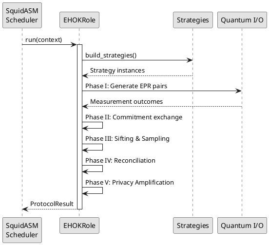

[← Return to Main Index](../index.md)

# 3.1 Architecture & Design Patterns

## Introduction

The E-HOK implementation employs a **layered modular architecture** that separates protocol orchestration from quantum operations and algorithmic strategies. The architecture adheres to the **Open/Closed Principle**, enabling extensions through new strategy implementations without modifying core protocol logic.

---

## Layered Architecture

The codebase is organized into five distinct layers with minimal coupling.

### Layer Responsibilities

| Layer | Purpose | Key Components |
|-------|---------|----------------|
| **1. Configuration & Data** | Centralize parameters and define validated data containers | `ProtocolConfig`, `ObliviousKey`, `ProtocolResult` |
| **2. Abstract Interfaces** | Define contracts for pluggable strategies | `ICommitmentScheme`, `IReconciliator`, `IPrivacyAmplifier` |
| **3. Implementations** | Provide concrete algorithm implementations | `SHA256Commitment`, `LDPCReconciliator`, `ToeplitzAmplifier` |
| **4. Protocol Orchestration** | Implement five-phase E-HOK workflow | `EHOKRole`, `AliceBaselineEHOK`, `BobBaselineEHOK` |
| **5. Quantum I/O** | Encapsulate NetSquid-specific operations | `QuantumPhaseRunner`, `EPRGenerator`, `MeasurementBuffer` |

**Rationale**: This layering enforces **Dependency Inversion**—high-level protocol logic depends on abstractions (Layer 2), not concrete implementations (Layer 3). This enables algorithm substitution without modifying protocol orchestration.

---

## Core Design Patterns

### 1. Strategy Pattern

Abstract interfaces (`ICommitmentScheme`, `IReconciliator`, etc.) allow hot-swapping of algorithmic strategies without modifying protocol logic.

**Extension Mechanism**: To add a new commitment scheme:
1. Implement the `ICommitmentScheme` interface
2. Update factory function to recognize the new type
3. No changes to `AliceBaselineEHOK` or `BobBaselineEHOK` required

### 2. Template Method Pattern

`EHOKRole.run()` defines a fixed protocol skeleton with role-specific behavior injected via abstract methods:

```
run() → Phase I (Quantum) → Phase II (Commitment) → Phase III (Sifting) 
      → Phase IV (Reconciliation) → Phase V (Privacy Amplification) → Result
```

Role asymmetry (Alice as verifier, Bob as prover) is isolated in subclass implementations, while common logic resides in the abstract base class.

### 3. Factory Pattern

Strategy objects are instantiated via factory functions parameterized by `ProtocolConfig`, enabling runtime configuration:

```python
commitment_scheme = build_commitment_scheme(config)
reconciliator = build_reconciliator(config)
privacy_amplifier = build_privacy_amplifier(config)
```

---

## Protocol Execution Flow



**Key Properties**:
- **Fixed Sequence**: Phases execute in strict order (I → II → III → IV → V)
- **Role Branching**: Logic branches on role (Alice/Bob) within each phase
- **Error Handling**: Exceptions converted to `ProtocolResult(success=False)`
- **Strategy Injection**: Algorithmic decisions delegated to strategy objects

---

## Quantum-Classical Separation

Layer 5 (Quantum I/O) isolates all framework-specific quantum operations:
- **EPR pair generation** via SquidASM's `EPRSocket`
- **Batching logic** to handle limited qubit memory
- **Measurement buffering** to accumulate outcomes across batches

This isolation enables:
1. Testing protocol logic with mock quantum results
2. Adapting to alternative quantum backends (Qiskit, ProjectQ)
3. Separating quantum simulation concerns from cryptographic correctness

---

[← Return to Main Index](../index.md) | [Next Section: Quantum Generation →](./quantum_generation.md)
